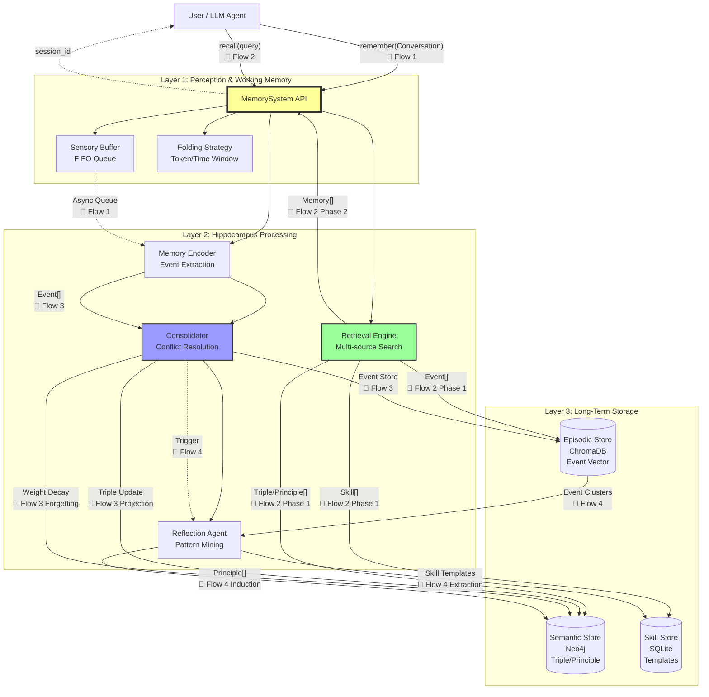
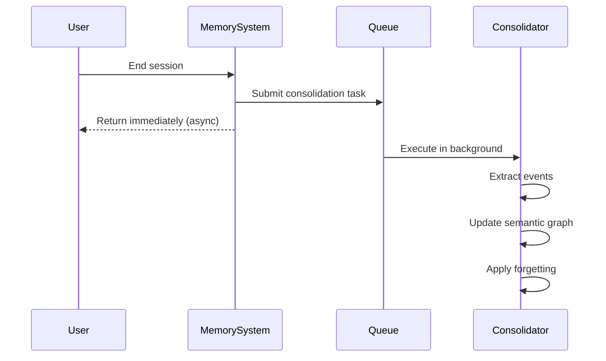

# **System Architecture & Constraints**

## **1. Overall Architecture**

The system is divided into three core layers: **Perception Layer**, **Hippocampus Processing Layer**, and **Storage Layer**.

### **1.1 系统架构总览**

系统对外暴露两个核心API：**`remember()`** 和 **`recall()`**，分别负责记忆写入和检索。



**Legend:**
- **实线**: 同步调用（Hot/Quick Path）
- **虚线**: 异步触发（Cold/Evolution Path）
- **📄 Flow N**: 对应 [workflows.md](workflows.md) 中的详细流程图
- **数据类型**: 边上标注的数据模型定义见 [interfaces.md](interfaces.md)

**API Entry Points:**

- **`remember(conversation)`**: 接收对话记录，立即返回session_id（异步巩固）
- **`recall(query, limit=10)`**: 检索相关记忆，同步返回排序结果（<200ms）

### **1.2 三条核心路径**

系统通过三条并行路径处理不同类型的操作：

| 路径 | 触发方式 | 延迟 | 说明 |
|------|---------|------|------|
| **Hot Path** | `recall()` 调用 | <200ms | 同步检索，零写操作 |
| **Quick Path** | `remember()` 调用 | <50ms | 快速返回，异步巩固 |
| **Cold Path** | 后台队列 | 异步 | 事件提取、图更新、遗忘 |
| **Evolution Path** | 定期触发 | 异步 | 深度反思、原则归纳 |

**详细流程:** 完整的时序图和交互细节请参见 → [核心流程文档](workflows.md)

---

## **2. Technology Stack**

### **Core Dependencies (Lightweight First)**

| 组件 | 技术选型 | 理由 | 可替换性 |
|------|---------|------|----------|
| **Vector Store** | ChromaDB | 嵌入式、零配置、纯 Python | `[Stable]` 可换 Milvus/Qdrant |
| **Semantic Store** | Neo4j | 原生图数据库、Cypher查询、支持向量索引 | `[Stable]` 可换 PostgreSQL+AGE |
| **数据模型** | Pydantic | Schema 验证、序列化 | `[Core]` 接口定义依赖 |
| **ORM** | SQLAlchemy | 事务管理、迁移工具 | `[Stable]` 可选 |
| **日志** | structlog | 结构化日志、trace_id 支持 | `[Stable]` |

### **开发工具**
- 包管理: `uv` (快速依赖解析)
- 测试: `pytest` + `pytest-asyncio` + `pytest-mock`
- 类型检查: `mypy` (严格模式)

## **4. Consolidation Mode**

The system adopts **asynchronous consolidation mode** to ensure low latency of the hot path (retrieval).

### **Asynchronous Consolidation Configuration**

```yaml
consolidation:
  mode: "asynchronous"         # 巩固模式：异步执行
  trigger: "background_queue"  # 触发方式：后台任务队列
  queue_timeout: 30            # 队列任务超时(秒)
  fallback: "synchronous"      # 降级策略：队列失败时同步执行
```

### **Design Principles**

| 维度 | 异步模式 | 优势 |
|------|---------|------|
| **性能** | 巩固在后台线程执行 | 热路径零阻塞，确保低延迟 |
| **可靠性** | 失败自动重试，超时降级 | 通过重试和死信队列保证最终一致性 |
| **资源利用** | 批处理多个会话 | 提高吞吐量，减少数据库连接开销 |
| **用户体验** | 会话结束立即返回 | 响应时间从秒级降至毫秒级 |

### **工作流程**


---

## **3. Two Representations of Semantic Storage: SemanticTriple vs Principle**

系统在语义层(Layer 2-3)使用两种不同但互补的数据结构：

### **SemanticTriple (Level 2: 知识图谱节点)**

**Definition:** Atomic-level knowledge representation storing individual factual relationships in Subject-Predicate-Object (S-P-O) form.

**Usage:**
- 存储在Neo4j图数据库中作为节点和边
- 支持图查询(Cypher)和关系推理
- 用于冲突检测和知识更新

**Source:**
- 从Event中提取 (derivation_type="extraction")
- 从其他Triple推导 (derivation_type="derivation")
- 版本替换 (derivation_type="supersession")

**Example:**
```python
SemanticTriple(
    subject="selenium",
    predicate="GOOD_FOR",
    object="dynamic_sites",
    weight=1.5,
    parent_ids=["evt_001", "evt_002"]
)
```

**Storage Location:** Neo4j Semantic Store (graph structure)

### **Principle (Level 3: 归纳原则)**

**Definition:** High-level abstract rules induced from multiple Events/Triples, expressed in natural language.

**Usage:**
- 作为可检索的记忆单元返回给LLM
- 指导未来决策和推理
- 支持反馈驱动的权重更新和版本演进

**Source:**
- 仅通过Reflection Agent归纳 (derivation_type="induction")
- 从多个相关Event中抽象出一般规律

**Example:**
```python
Principle(
    content="Dynamic websites requiring JavaScript need browser automation tools like Selenium",
    evidence_count=5,
    confidence=0.85,
    parent_ids=["evt_001", "evt_002", "evt_003"]
)
```

**Storage Location:** 
- **当前实现**: Principle对象在检索时动态构建，底层由SemanticTriple支撑
- **未来扩展**: 可能在Neo4j中作为特殊类型节点独立存储

### **Comparison of Both**

| 特性 | SemanticTriple | Principle |
|------|---------------|-----------|
| **抽象级别** | 原子事实 | 高层规则 |
| **表达形式** | S-P-O三元组 | 自然语言陈述 |
| **主要用途** | 图推理、冲突检测 | 记忆检索、指导决策 |
| **存储方式** | Neo4j图节点/边 | 动态构建或独立节点 |
| **派生方式** | extraction/derivation/supersession | induction |
| **可检索性** | 通过图查询 | 通过语义搜索 |
| **反馈机制** | 权重更新 | 权重+版本演进 |

**Architecture Intent:** Triples provide fine-grained knowledge graph infrastructure, while Principles provide coarse-grained interpretable memory units. Both complement each other to support the semantic memory system.

---

**关联文档：**
- [系统设计理念](design.md) - 设计哲学和核心概念
- [组件详情](components.md) - 各个组件的职责和实现
- [核心流程](workflows.md) - 系统如何运作
