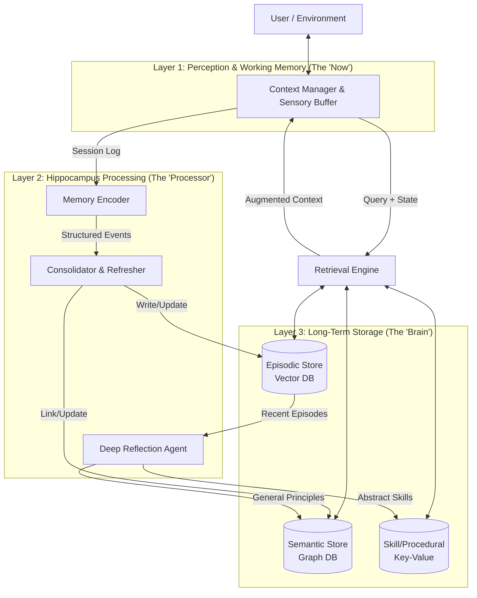

# **系统架构与约束 (System Architecture & Constraints)**

## **1. 整体架构 (System Architecture)**

系统划分为三个核心层级：**感知层 (Perception)**、**处理层 (Hippocampus)**、**存储层 (Storage)**。



## **2. 系统约束与性能边界 (System Constraints & SLA)**

### **容量限制**

ChromaDB 实测数据 (基于768维向量):
- **推荐上限**: <50万条 (保证 P95 < 200ms)
- **理论上限**: ~100万条 (性能下降，P95 可能达到 500ms+)
- **索引大小**: 768维向量 × N条 × 4字节 ≈ 3KB/条
- **内存占用**: 10万条 ≈ 300MB (索引) + 100MB (元数据)

系统限制:
- 并发用户数: 设计目标 10 并发，可通过横向扩展提升
- 单次检索结果: 默认 Top-10，最大 100 条

迁移路径:

| 数据量 | 推荐方案 | 预期性能 |
|--------|---------|----------|
| <10万 | ChromaDB嵌入式 | P95 <200ms |
| 10-50万 | ChromaDB嵌入式 + 定期清理 | P95 <500ms |
| >50万 | Milvus分布式 | P95 <200ms |

### **性能指标 (SLA)**

前提条件:
- 硬件: 现代SSD (读速度 >500MB/s)
- 数据规模: 单用户 <10万条记忆
- 网络: 本地部署 (嵌入式数据库)

目标延迟:
- **热路径 (retrieve):** P50 < 50ms, P95 < 200ms，P99 < 500ms
- **冷路径 (consolidate):** 异步执行，超时上限 30s (假设单次处理 <100 个事件)

检索质量 (基于 golden dataset 定期验证):
- **最低可接受:** ≥ 80% (低于此值触发告警)
- **期望目标:** ≥ 85% (正常运行)
- **优秀目标:** ≥ 90% (优化后达成)

降级标准:
- 数据量 10-50万: P95 < 500ms, P99 < 1s
- 数据量 >50万: 建议迁移到 Milvus 分布式版本

设计原则:
- 热路径零写操作，确保低延迟
- 冷路径容忍失败，通过重试和死信队列保证最终一致性
- 超出容量时的迁移路径: ChromaDB → Milvus, Neo4j → 分布式 Neo4j 集群

## **3. 技术选型 (Technology Stack)**

### **核心依赖 (轻量级优先)**

| 组件 | 技术选型 | 理由 | 可替换性 |
|------|---------|------|----------|
| **Vector Store** | ChromaDB | 嵌入式、零配置、纯 Python | `[Stable]` 可换 Milvus/Qdrant |
| **Semantic Store** | Neo4j | 原生图数据库、Cypher查询、支持向量索引 | `[Stable]` 可换 PostgreSQL+AGE |
| **LLM 接口** | LiteLLM | 统一 API (OpenAI/Anthropic/Ollama) | `[Core]` 抽象层不变 |
| **数据模型** | Pydantic | Schema 验证、序列化 | `[Core]` 接口定义依赖 |
| **ORM** | SQLAlchemy | 事务管理、迁移工具 | `[Stable]` 可选 |
| **日志** | structlog | 结构化日志、trace_id 支持 | `[Stable]` |

### **开发工具**
- 包管理: `uv` (快速依赖解析)
- 测试: `pytest` + `pytest-asyncio` + `pytest-mock`
- 类型检查: `mypy` (严格模式)

## **4. 实施阶段 (Implementation Phases)**

### **Phase 1: MVP 核心 (2-3周)**

**目标:** 实现基础的记忆存储与检索，验证核心假设。

**范围:**
- ✅ `MemorySystem` 基础接口: `retrieve()`, `ingest()`, `consolidate()`
- ✅ Episodic Store (ChromaDB) + 简单向量检索
- ✅ Context Manager 基础版 (无 Folding)
- ✅ **同步巩固**: 会话结束时阻塞执行，确保数据一致性

**巩固配置:**
```yaml
consolidation:
  mode: "synchronous"  # Phase 1 固定为同步
  trigger: "on_session_end"  # 会话结束时触发
```

**验收标准:**
- 通过 **Goldfish Test** (简化版: 仅验证多轮对话后能召回早期信息)
- 通过 **"Don't Repeat Mistakes" Test**

**依赖:**
```toml
chromadb = "^0.4.0"
litellm = "^1.0.0"
pydantic = "^2.0.0"
structlog = "^24.0.0"
```

### **Phase 2: 语义层 (3-4周)**

**目标:** 添加知识图谱与冲突解决机制。

**范围:**
- ✅ Semantic Store (Neo4j 图数据库)
- ✅ Memory Encoder (事实提取)
- ✅ 冲突检测与权重更新
- ✅ 记忆再巩固机制

**验收标准:**
- 通过 **"Change of Mind" Test**

**新增依赖:**
```toml
sqlalchemy = "^2.0.0"
alembic = "^1.13.0"  # 数据库迁移
```

### **Phase 3: 智能进化 (4-6周)**

**目标:** 实现跨任务归纳与原则生成。

**范围:**
- ✅ Deep Reflection Agent
- ✅ 情景记忆聚类
- ✅ 原则抽象与存储
- ✅ **异步巩固**: 后台任务队列处理，提升响应速度

**巩固配置:**
```yaml
consolidation:
  mode: "asynchronous"  # Phase 3 升级为异步
  trigger: "background_queue"  # 后台队列处理
  fallback: "synchronous"  # 队列失败时降级为同步
  queue_timeout: 30  # 队列任务超时时间(秒)
```

**验收标准:**
- 通过 **"Sherlock" Test**

**新增依赖:**
```toml
scikit-learn = "^1.4.0"  # 聚类算法
```

---

**关联文档：**
- [系统设计理念](design.md) - 设计哲学和核心概念
- [组件详情](components.md) - 各个组件的职责和实现
- [核心流程](workflows.md) - 系统如何运作
