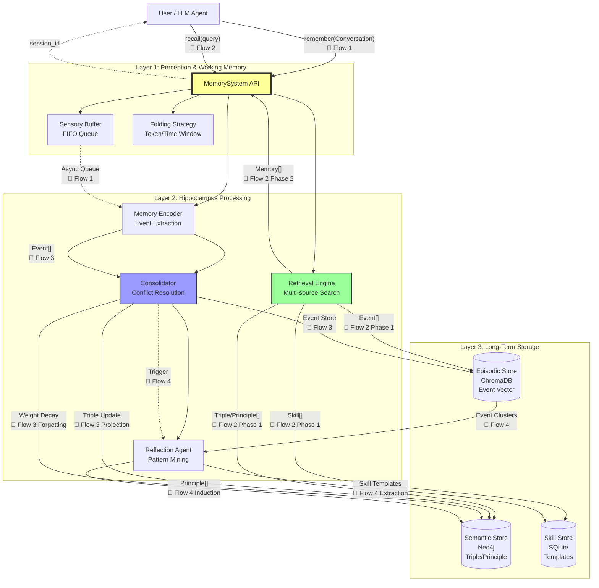
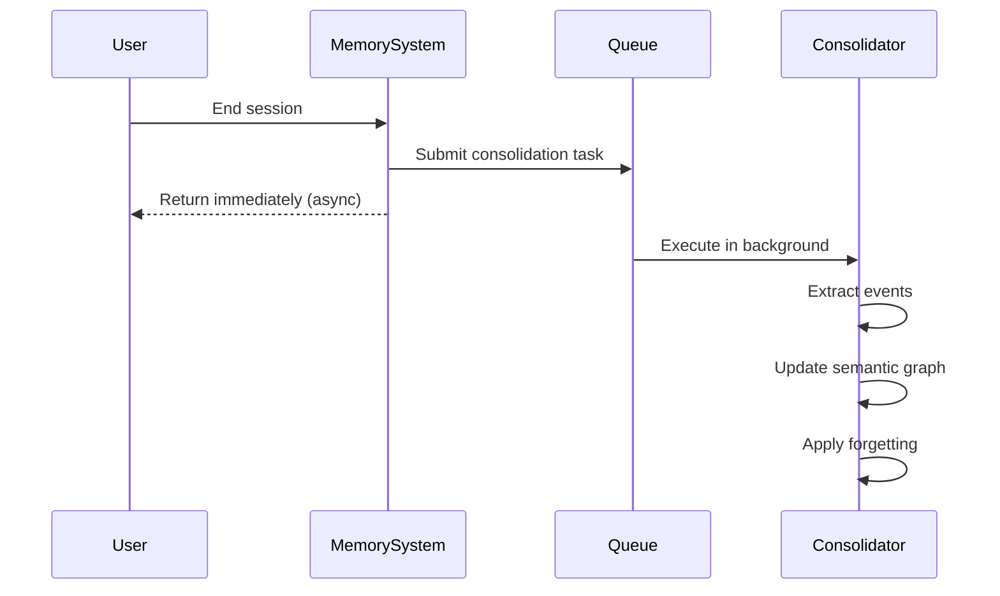

# **System Architecture & Constraints**

## **1. Overall Architecture**

The system is divided into three core layers: **Perception Layer**, **Hippocampus Processing Layer**, and **Storage Layer**.

### **1.1 System Architecture Overview**

The system exposes two core APIs: **`remember()`** and **`recall()`**, responsible for memory storage and retrieval respectively.



**Legend:**
- **Solid lines**: Synchronous calls (Hot/Quick Path)
- **Dashed lines**: Async triggers (Cold/Evolution Path)
- **📄 Flow N**: Detailed flow diagrams in [workflows.md](workflows.md)
- **Data types**: Data model definitions on edges are defined in [interfaces.md](interfaces.md)

**API Entry Points:**

- **`remember(conversation)`**: Accepts conversation records, immediately returns session_id (async consolidation)
- **`recall(query, limit=10)`**: Retrieves relevant memories, synchronously returns sorted results (<200ms)

### **1.2 Three Core Paths**

The system processes different types of operations through three parallel paths:

| Path | Trigger | Latency | Description |
|------|---------|---------|-------------|
| **Hot Path** | `recall()` call | <200ms | Synchronous retrieval, zero write operations |
| **Quick Path** | `remember()` call | <50ms | Fast return, async consolidation |
| **Cold Path** | Background queue | Async | Event extraction, graph updates, forgetting |
| **Evolution Path** | Periodic trigger | Async | Deep reflection, principle induction |

**Detailed flow:** Complete sequence diagrams and interaction details → [Core Workflows Document](workflows.md)

---

## **2. Technology Stack**

### **Core Dependencies (Lightweight First)**

| Component | Technology Choice | Rationale | Replaceability |
|------|---------|------|----------|
| **Vector Store** | ChromaDB | Embedded, zero-config, pure Python | `[Stable]` Can swap with Milvus/Qdrant |
| **Semantic Store** | Neo4j | Native graph database, Cypher queries, vector index support | `[Stable]` Can swap with PostgreSQL+AGE |
| **Data Models** | Pydantic | Schema validation, serialization | `[Core]` Interface definitions depend on it |
| **ORM** | SQLAlchemy | Transaction management, migration tools | `[Stable]` Optional |
| **Logging** | structlog | Structured logging, trace_id support | `[Stable]` |

### **Development Tools**
- Package management: `uv` (fast dependency resolution)
- Testing: `pytest` + `pytest-asyncio` + `pytest-mock`
- Type checking: `mypy` (strict mode)

## **4. Consolidation Mode**

The system adopts **asynchronous consolidation mode** to ensure low latency of the hot path (retrieval).

### **Asynchronous Consolidation Configuration**

```yaml
consolidation:
  mode: "asynchronous"         # Consolidation mode: asynchronous execution
  trigger: "background_queue"  # Trigger method: background task queue
  queue_timeout: 30            # Queue task timeout (seconds)
  fallback: "synchronous"      # Fallback strategy: synchronous execution on queue failure
```

### **Design Principles**

| Dimension | Asynchronous Mode | Advantage |
|------|---------|------|
| **Performance** | Consolidation runs in background thread | Hot path zero-blocking, ensures low latency |
| **Reliability** | Automatic retry on failure, fallback on timeout | Eventual consistency through retry and dead-letter queue |
| **Resource Utilization** | Batch processing multiple sessions | Improved throughput, reduced database connection overhead |
| **User Experience** | Session end returns immediately | Response time reduced from seconds to milliseconds |

### **Workflow**


---

## **3. Two Representations of Semantic Storage: SemanticTriple vs Principle**

The system uses two different but complementary data structures at the semantic layer (Layer 2-3):

### **SemanticTriple (Level 2: Knowledge Graph Nodes)**

**Definition:** Atomic-level knowledge representation storing individual factual relationships in Subject-Predicate-Object (S-P-O) form.

**Usage:**
- Stored in Neo4j graph database as nodes and edges
- Supports graph queries (Cypher) and relationship reasoning
- Used for conflict detection and knowledge updates

**Source:**
- Extracted from Event (derivation_type="extraction")
- Derived from other Triples (derivation_type="derivation")
- Version replacement (derivation_type="supersession")

**Example:**
```python
SemanticTriple(
    subject="selenium",
    predicate="GOOD_FOR",
    object="dynamic_sites",
    weight=1.5,
    parent_ids=["evt_001", "evt_002"]
)
```

**Storage Location:** Neo4j Semantic Store (graph structure)

### **Principle (Level 3: Induced Principles)**

**Definition:** High-level abstract rules induced from multiple Events/Triples, expressed in natural language.

**Usage:**
- Retrievable memory units returned to LLM
- Guide future decision-making and reasoning
- Support feedback-driven weight updates and version evolution

**Source:**
- Only induced through Reflection Agent (derivation_type="induction")
- Abstracts general patterns from multiple related Events

**Example:**
```python
Principle(
    content="Dynamic websites requiring JavaScript need browser automation tools like Selenium",
    evidence_count=5,
    confidence=0.85,
    parent_ids=["evt_001", "evt_002", "evt_003"]
)
```

**Storage Location:**
- **Current implementation**: Principle objects are dynamically constructed at retrieval time, backed by SemanticTriple
- **Future extension**: May be independently stored as special type nodes in Neo4j

### **Comparison of Both**

| Feature | SemanticTriple | Principle |
|------|---------------|-----------|
| **Abstraction Level** | Atomic facts | High-level rules |
| **Expression Form** | S-P-O triplet | Natural language statement |
| **Primary Purpose** | Graph reasoning, conflict detection | Memory retrieval, decision guidance |
| **Storage Method** | Neo4j graph nodes/edges | Dynamically constructed or independent nodes |
| **Derivation Method** | extraction/derivation/supersession | induction |
| **Searchability** | Via graph queries | Via semantic search |
| **Feedback Mechanism** | Weight updates | Weight + version evolution |

**Architecture Intent:** Triples provide fine-grained knowledge graph infrastructure, while Principles provide coarse-grained interpretable memory units. Both complement each other to support the semantic memory system.

---

**Related Documents:**
- [System Design Philosophy](design.md) - Design philosophy and core concepts
- [Component Details](components.md) - Responsibilities and implementations of each component
- [Core Workflows](workflows.md) - How the system works
