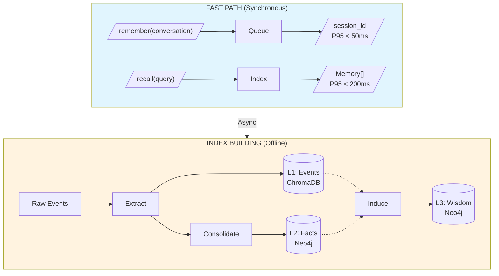
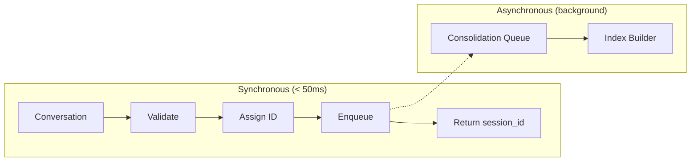
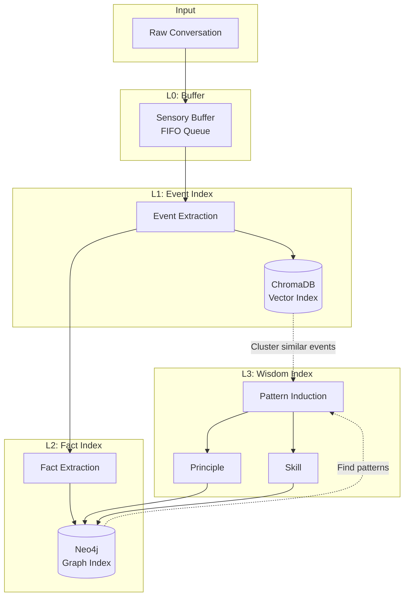
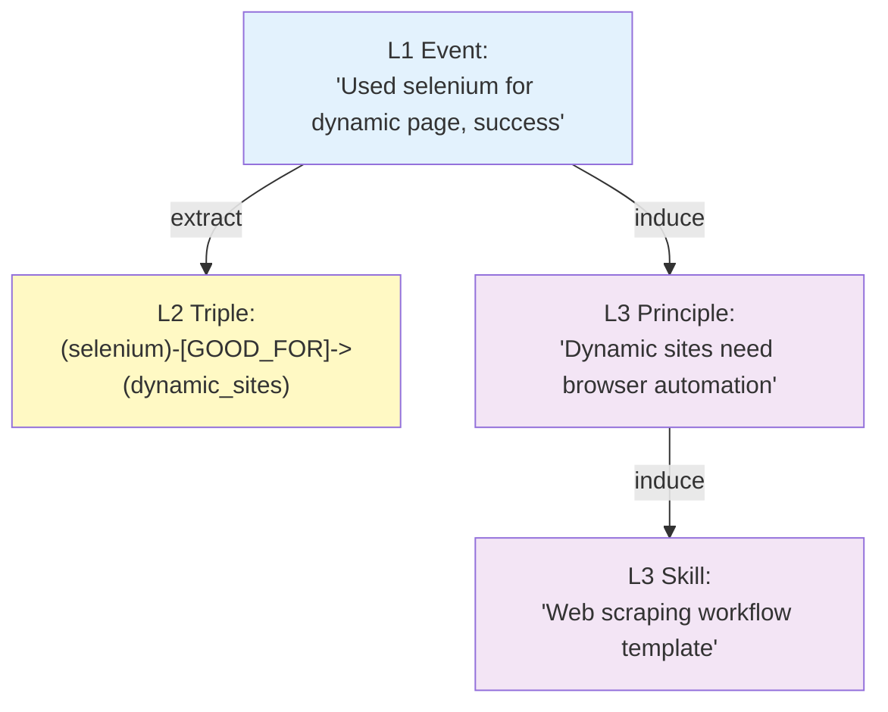

# **System Architecture**

## **1. Design Philosophy**

The memory system is designed around one core principle: **fast in, fast out, smart indexing offline**.



**Goal:** Build better indexes offline to make `recall()` more accurate.

---

## **2. API Contract**

The system exposes exactly **two** public APIs:

### **2.1 remember(conversation) → session_id**

**Purpose:** Store conversation for later processing.

**Contract:**
- **Latency:** P95 < 50ms (must be fast)
- **Behavior:** Enqueue only, no heavy computation
- **Return:** session_id immediately
- **Side effect:** Triggers async index building

```python
def remember(conversation: Conversation | list[Message]) -> str:
    """
    Fast storage - just enqueue and return.

    What happens synchronously:
    1. Validate input
    2. Assign session_id
    3. Push to consolidation queue
    4. Return session_id

    What happens asynchronously (see workflows.md):
    1. Extract events from conversation
    2. Build L1/L2/L3 indexes
    3. Update existing index weights
    """
```

### **2.2 recall(query) → Iterator[Memory]**

**Purpose:** Retrieve relevant memories for the current context.

**Contract:**
- **Latency:** P95 < 200ms (must be fast)
- **Behavior:** Index lookup only, no heavy computation
- **Return:** Ranked memories with source tags

```python
def recall(
    query: str | Message | Conversation,
    limit: int = 10,
    filters: dict | None = None
) -> Iterator[Memory]:
    """
    Fast retrieval - lookup pre-built indexes.

    What happens:
    1. Query L3 indexes (Principle, Skill) - semantic match
    2. Query L2 indexes (SemanticTriple) - graph traversal
    3. Query L1 indexes (Event) - vector similarity
    4. Merge and rank results
    5. Return with source tags for feedback tracking

    Returns memories tagged as:
    - <principle id="xxx">...</principle>
    - <skill id="yyy">...</skill>
    - <memory id="zzz">...</memory>
    """
```

---

## **3. Data Flow**

### **3.1 Write Path (remember)**



### **3.2 Read Path (recall)**

```mermaid
flowchart LR
    subgraph Sync ["Synchronous (< 200ms)"]
        A[Query] --> B[Parse Intent]
        B --> C{Parallel Lookup}
        C --> D[L3: Principle/Skill]
        C --> E[L2: SemanticTriple]
        C --> F[L1: Event]
        D --> G[Merge & Rank]
        E --> G
        F --> G
        G --> H[Return Memory[]]
    end
```

### **3.3 Index Building (Offline)**



---

## **4. Index Hierarchy**

The system builds a **three-level index hierarchy** from raw data:

| Level | Index Type | Content | Storage | Query Method |
|-------|-----------|---------|---------|--------------|
| **L1** | Event | Task-Action-Result records | ChromaDB | Vector similarity |
| **L2** | SemanticTriple | Entity relationships (S-P-O) | Neo4j | Graph traversal |
| **L3** | Principle / Skill | Abstracted wisdom | Neo4j | Semantic match |

**Key Insight:** L2 and L3 indexes are **derived from** L1 events. They are not independent data, but **pre-computed indexes** that accelerate retrieval.

### **Index Relationships**



**Provenance Chain:** Every L2/L3 index maintains `parent_ids` pointing back to source events.

---

## **5. Storage Architecture**

| Component | Technology | Purpose | Index Level |
|-----------|------------|---------|-------------|
| **SensoryBuffer** | In-memory deque | Temporary queue | L0 |
| **EpisodicStore** | ChromaDB | Event vector index | L1 |
| **SemanticStore** | Neo4j | Fact graph + Principle/Skill | L2, L3 |
| **IndexStore** | SQLite | Usage statistics (IndexProfile) | Metadata |

### **Why This Stack?**

- **ChromaDB:** Embedded, zero-config, optimized for vector search
- **Neo4j:** Native graph traversal, Cypher queries, supports vector index
- **SQLite:** High-frequency read/write for statistics, no network overhead

---

## **6. Performance Boundaries**

| Operation | Target | Hard Limit | Bottleneck |
|-----------|--------|------------|------------|
| `remember()` | P95 < 50ms | 100ms | Queue insertion |
| `recall()` | P95 < 200ms | 500ms | Index lookup |
| Index building | Background | N/A | LLM API calls |
| Index maintenance | Daily batch | N/A | Database writes |

### **Ensuring Fast Path Performance**

1. **remember():** No LLM calls, no DB writes, just enqueue
2. **recall():** Pre-built indexes, parallel queries, early termination
3. **Heavy work offloaded:** All LLM-based extraction/induction is async

---

## **7. Technology Choices**

| Component | Choice | Rationale | Alternatives |
|-----------|--------|-----------|--------------|
| Vector Store | ChromaDB | Embedded, Python-native | Milvus, Qdrant |
| Graph Store | Neo4j | Native graph, Cypher, vector support | PostgreSQL+AGE |
| Statistics | SQLite | Fast, embedded, ACID | Redis |
| LLM | LiteLLM | Unified API, provider-agnostic | Direct API |
| Queue | In-memory | Simple, sufficient for single-node | Redis, RabbitMQ |

---

**Related Documents:**
- [Core Workflows](workflows.md) - How indexes are built and maintained
- [Interface Definitions](interfaces.md) - Data model specifications
- [Component Details](components.md) - Component responsibilities
