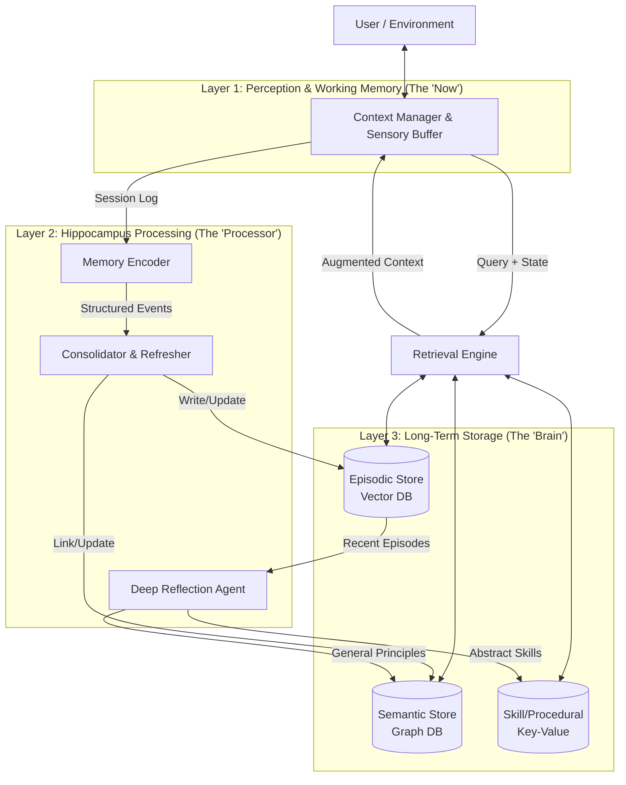
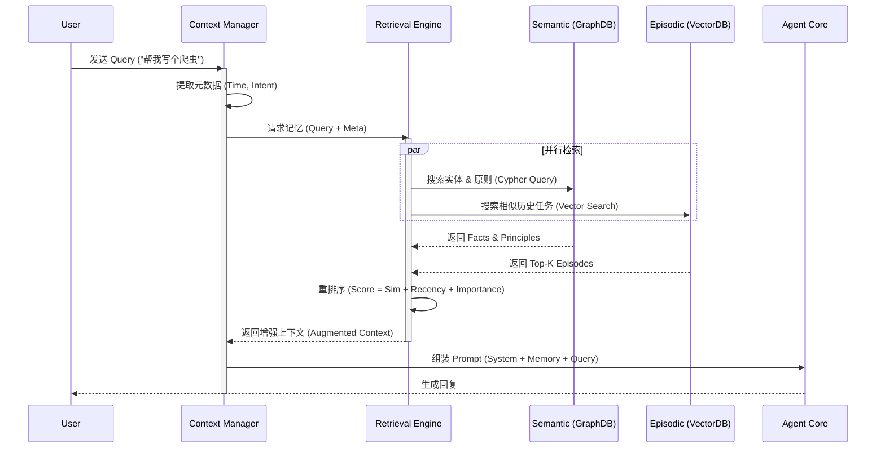
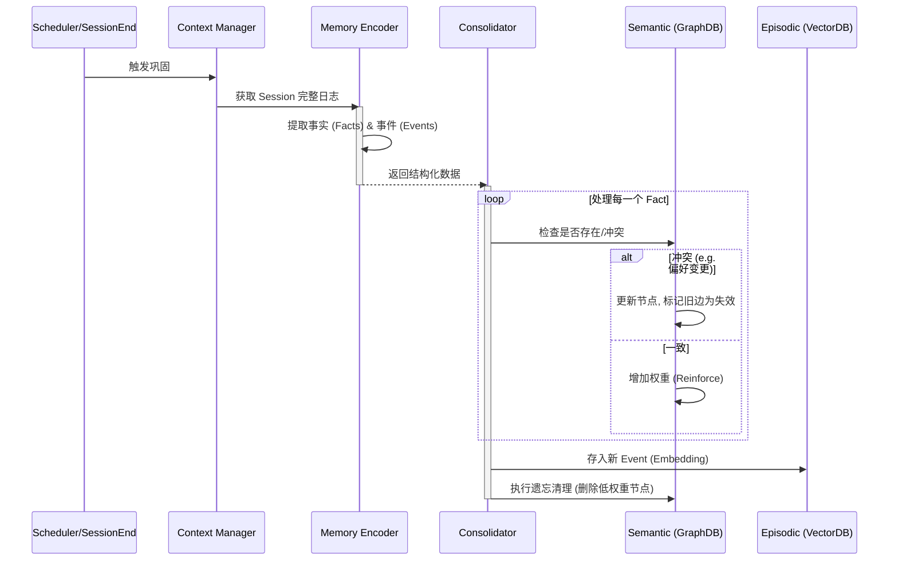
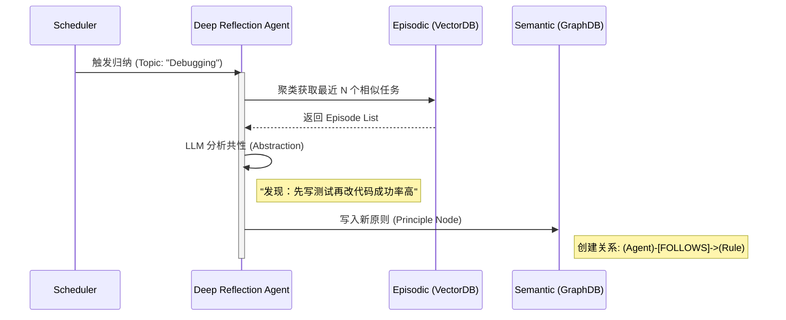
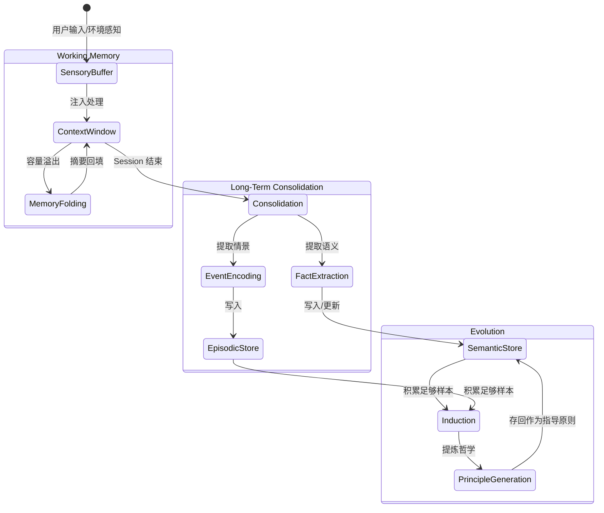
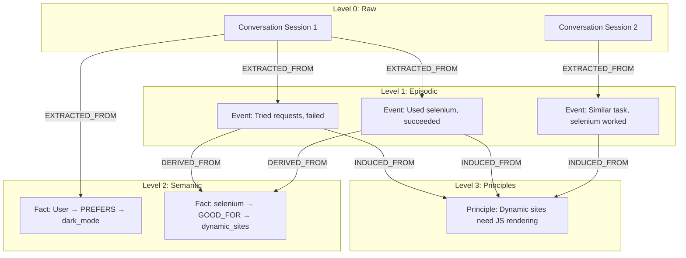

# **认知型 Agent 记忆系统 (Cognitive Agent Memory System \- CAMS) 设计方案**

## **1\. 设计理念 (Design Philosophy)**

本系统旨在解决传统 Agent "有记忆无智慧"（只存不忘、只查不改、只知其一不知其三）的问题。基于认知神经科学的 **Atkinson-Shiffrin 记忆模型**，本系统模拟人类记忆系统的三层架构：

1. **感觉记忆 (Sensory Memory):** 短暂缓冲原始输入，对应系统的 Sensory Buffer。
2. **工作记忆 (Working Memory):** 有限容量的活跃信息处理区，对应 Context Manager 维护的上下文窗口。
3. **长期记忆 (Long-Term Memory):** 持久化的知识库，包含情景记忆(经历)、语义记忆(事实/原则)、程序化记忆(技能)。

**关键神经科学机制映射：**

- **海马体巩固 (Hippocampal Consolidation):** 对应 Consolidator 组件，将工作记忆转化为长期记忆。
- **记忆再巩固 (Reconsolidation):** 每次检索时触发权重更新，记忆不是"一次写入永久固定"，而是动态强化。
- **主动遗忘 (Active Forgetting):** 区分时间衰减(基于访问频率)和干扰遗忘(基于冲突)，删除低权重节点是突触稳态可塑性的体现，防止信息过载。
- **系统巩固 (Systems Consolidation):** 对应 Deep Reflection Agent，从具体经历中提炼抽象原则。

**注意:** 本系统借鉴但不等同于 Kahneman 的双系统理论(快慢思维)，后者关注决策过程而非记忆架构。我们的"热路径/冷路径"指的是检索(实时)与巩固(异步)的处理时序差异。

## **2\. 整体架构 (System Architecture)**

系统划分为三个核心层级：**感知层 (Perception)**、**处理层 (Hippocampus)**、**存储层 (Storage)**。



## **2.1\. 系统约束与性能边界 (System Constraints & SLA)**

**容量限制:**

ChromaDB 实测数据 (基于768维向量):
- **推荐上限**: <50万条 (保证 P95 < 200ms)
- **理论上限**: ~100万条 (性能下降，P95 可能达到 500ms+)
- **索引大小**: 768维向量 × N条 × 4字节 ≈ 3KB/条
- **内存占用**: 10万条 ≈ 300MB (索引) + 100MB (元数据)

系统限制:
- 并发用户数: 设计目标 10 并发，可通过横向扩展提升
- 单次检索结果: 默认 Top-10，最大 100 条

迁移路径:
| 数据量 | 推荐方案 | 预期性能 |
|--------|---------|----------|
| <10万 | ChromaDB嵌入式 | P95 <200ms |
| 10-50万 | ChromaDB嵌入式 + 定期清理 | P95 <500ms |
| >50万 | Milvus分布式 | P95 <200ms |

**性能指标 (SLA):**

前提条件:
- 硬件: 现代SSD (读速度 >500MB/s)
- 数据规模: 单用户 <10万条记忆
- 网络: 本地部署 (嵌入式数据库)

目标延迟:
- **热路径 (retrieve):** P50 < 50ms, P95 < 200ms，P99 < 500ms
- **冷路径 (consolidate):** 异步执行，超时上限 30s (假设单次处理 <100 个事件)

检索质量 (基于 golden dataset 定期验证):
- **最低可接受:** ≥ 80% (低于此值触发告警)
- **期望目标:** ≥ 85% (正常运行)
- **优秀目标:** ≥ 90% (优化后达成)

降级标准:
- 数据量 10-50万: P95 < 500ms, P99 < 1s
- 数据量 >50万: 建议迁移到 Milvus 分布式版本

**设计原则:**
- 热路径零写操作，确保低延迟
- 冷路径容忍失败，通过重试和死信队列保证最终一致性
- 超出容量时的迁移路径: ChromaDB → Milvus, SQLite → PostgreSQL

## **2.2\. 技术选型 (Technology Stack)**

**核心依赖 (轻量级优先):**

| 组件 | 技术选型 | 理由 | 可替换性 |
|------|---------|------|----------|
| **Vector Store** | ChromaDB | 嵌入式、零配置、纯 Python | `[Stable]` 可换 Milvus/Qdrant |
| **Semantic Store** | SQLite (三元组表) | 单文件、事务支持、跨平台 | `[Stable]` 可换 Neo4j/PostgreSQL |
| **LLM 接口** | LiteLLM | 统一 API (OpenAI/Anthropic/Ollama) | `[Core]` 抽象层不变 |
| **数据模型** | Pydantic | Schema 验证、序列化 | `[Core]` 接口定义依赖 |
| **ORM** | SQLAlchemy | 事务管理、迁移工具 | `[Stable]` 可选 |
| **日志** | structlog | 结构化日志、trace_id 支持 | `[Stable]` |

**开发工具:**
- 包管理: `uv` (快速依赖解析)
- 测试: `pytest` + `pytest-asyncio` + `pytest-mock`
- 类型检查: `mypy` (严格模式)

## **2.3\. 实施阶段 (Implementation Phases)**

### **Phase 1: MVP 核心 (2-3周)**

**目标:** 实现基础的记忆存储与检索，验证核心假设。

**范围:**
- ✅ `MemorySystem` 基础接口: `retrieve()`, `ingest()`, `consolidate()`
- ✅ Episodic Store (ChromaDB) + 简单向量检索
- ✅ Context Manager 基础版 (无 Folding)
- ✅ **同步巩固**: 会话结束时阻塞执行，确保数据一致性

**巩固配置:**
```yaml
consolidation:
  mode: "synchronous"  # Phase 1 固定为同步
  trigger: "on_session_end"  # 会话结束时触发
```

**验收标准:**
- 通过 **Goldfish Test** (简化版: 仅验证多轮对话后能召回早期信息)
- 通过 **"Don't Repeat Mistakes" Test**

**依赖:**
```toml
chromadb = "^0.4.0"
litellm = "^1.0.0"
pydantic = "^2.0.0"
structlog = "^24.0.0"
```

### **Phase 2: 语义层 (3-4周)**

**目标:** 添加知识图谱与冲突解决机制。

**范围:**
- ✅ Semantic Store (SQLite 三元组表)
- ✅ Memory Encoder (事实提取)
- ✅ 冲突检测与权重更新
- ✅ 记忆再巩固机制

**验收标准:**
- 通过 **"Change of Mind" Test**

**新增依赖:**
```toml
sqlalchemy = "^2.0.0"
alembic = "^1.13.0"  # 数据库迁移
```

### **Phase 3: 智能进化 (4-6周)**

**目标:** 实现跨任务归纳与原则生成。

**范围:**
- ✅ Deep Reflection Agent
- ✅ 情景记忆聚类
- ✅ 原则抽象与存储
- ✅ **异步巩固**: 后台任务队列处理，提升响应速度

**巩固配置:**
```yaml
consolidation:
  mode: "asynchronous"  # Phase 3 升级为异步
  trigger: "background_queue"  # 后台队列处理
  fallback: "synchronous"  # 队列失败时降级为同步
  queue_timeout: 30  # 队列任务超时时间(秒)
```

**验收标准:**
- 通过 **"Sherlock" Test**

**新增依赖:**
```toml
scikit-learn = "^1.4.0"  # 聚类算法
```

## **3\. 组件详情与职责 (Component Details)**

### **第 1 层：感知与工作记忆 (Perception & Working Memory)**

负责处理当前的交互流（Inside-trail），维护“意识”的连续性。

#### **A. 上下文管理器 (Context Manager)** `[Core]`

* **职责:** 维护 LLM 的有限上下文窗口，防止溢出，同时保持对话连贯。  
* **输入:** 用户的新 Query、检索到的长期记忆。  
* **输出:** 最终构建的 System Prompt。  
* **核心机制:** **动态折叠 (Memory Folding)**，通过策略模式实现可插拔。

**可插拔策略接口:**

**✅ 实现状态**: 已完成统一接口设计，所有策略位于 `hmem.perception.strategies`

```python
# 单一真实来源: hmem/perception/strategies/folding.py
from abc import ABC, abstractmethod
from typing import Any

class FoldingStrategy(ABC):
    """记忆折叠策略抽象基类 - 单一接口定义
    
    所有折叠实现必须继承此类，确保接口一致性。
    位置: src/hmem/perception/strategies/folding.py
    """
    
    @abstractmethod
    def should_fold(self, messages: list[dict[str, Any]], token_count: int, limit: int) -> bool:
        """判断是否需要折叠
        
        Args:
            messages: 当前消息历史
            token_count: 当前估计的 token 数量
            limit: 最大 token 限制
        
        Returns:
            True 表示应该触发折叠
        """
        pass
    
    @abstractmethod
    def compress(self, messages: list[dict[str, Any]]) -> str:
        """执行压缩，返回摘要文本
        
        Args:
            messages: 待压缩的消息列表
        
        Returns:
            压缩后的摘要文本
        """
        pass
    
    def estimate_tokens(self, text: str) -> int:
        """估算文本的 token 数量 (可选重写)"""
        return len(text) // 4  # 默认: 约 4 字符/token

# ============ 具体策略实现 ============

class TokenBasedFolder(FoldingStrategy):
    """基于 Token 阈值的折叠策略 (默认)
    
    位置: src/hmem/perception/strategies/token_based.py
    
    阈值设计考虑:
    - 太低(如0.6): 频繁折叠，丢失细节
    - 太高(如0.95): 折叠太晚，可能溢出
    - 0.8: 经验平衡点，为突发长消息预留20%缓冲
    """
    
    def __init__(self, trigger_ratio: float = 0.8):
        """初始化折叠策略
        
        Args:
            trigger_ratio: 触发折叠的比例 (推荐范围: 0.5-0.95)
                - 0.6: 激进折叠，节省成本
                - 0.8: 平衡 (默认)
                - 0.9: 保守折叠，保留更多细节
        """
        if not (0.5 <= trigger_ratio <= 0.95):
            raise ValueError("trigger_ratio 应在 0.5-0.95 之间")
        self.trigger_ratio = trigger_ratio
    
    def should_fold(self, messages, token_count, limit):
        return token_count > limit * self.trigger_ratio
    
    def compress(self, messages):
        # Phase 1: 简单摘要
        # Phase 2+: 使用 LLM 生成智能摘要
        return f"[Summarized {len(messages)} messages]"

class TimeWindowFolder(FoldingStrategy):
    """基于时间窗口的折叠策略
    
    位置: src/hmem/perception/strategies/time_window.py
    ✅ 实现状态: 已完成
    
    适用场景:
    - 跨越多小时/天的长对话
    - 时间上下文比 token 数量更重要的场景
    """
    
    def __init__(self, window_hours: float = 24.0):
        """初始化时间窗口策略
        
        Args:
            window_hours: 触发折叠的时间窗口 (小时)
        """
        self.window_hours = window_hours
    
    def should_fold(self, messages, token_count, limit):
        if not messages:
            return False
        oldest_timestamp = messages[0].get('timestamp')
        if not oldest_timestamp:
            return False
        from datetime import datetime, timedelta
        return (datetime.now() - oldest_timestamp) > timedelta(hours=self.window_hours)
    
    def compress(self, messages):
        # 包含时间范围的摘要
        return f"[Summarized {len(messages)} messages from past {self.window_hours}h]"
```

**配置示例:**
```yaml
memory:
  folding_strategy: "h_mem.strategies.TokenBasedFolder"
  folding_threshold: 0.8
```

#### **B. 感知缓冲 (Sensory Buffer)**

* **职责:** 暂存原始的多模态日志（Raw Logs），作为“海马体”处理的原材料。  
* **机制:** 简单的 FIFO 队列或 Redis 列表。

### **第 2 层：海马体处理层 (Hippocampus Processing)**

这是系统的**调度中心**，负责将短期记忆转化为长期记忆，并提炼智慧。

#### **C. 记忆编码器 (Memory Encoder)**

* **职责:** 将非结构化对话转化为结构化数据。  
* **机制:** 区分处理。  
  * **事实提取:** 识别实体关系（如 User \-\> Location \-\> Beijing）。  
  * **事件提取:** 识别完整的 Task-Action-Result 链条。

#### **D. 巩固与刷新器 (Consolidator & Refresher)** `[Stable]`

* **职责:** 模拟"睡眠"过程，处理记忆的写入、冲突修正和遗忘。  
* **触发:** 同步执行 (Phase 1), 异步执行 (Phase 3)。  
* **输入:** 结构化的事件和事实。  
* **输出:** 数据库的增删改操作 + 统计报告。  

**事务管理与并发控制:**

```python
import fcntl
from contextlib import contextmanager
from sqlalchemy import exc

class Consolidator:
    
    @contextmanager
    def _session_lock(self, session_id: str):
        """防止同一 session 并发巩固 (可插拔锁后端)"""
        # 使用抽象的 LockProvider，支持单机和分布式场景
        with self.lock_provider.acquire(f"consolidate:{session_id}", timeout=30):
            yield

class LockProvider(ABC):
    """锁抽象层 - 支持从单机到分布式的平滑迁移"""
    
    @abstractmethod
    @contextmanager
    def acquire(self, key: str, timeout: float) -> Iterator[None]:
        """获取锁，超时抛出 LockTimeoutError"""
        pass

class FileLockProvider(LockProvider):
    """文件锁实现 (默认，适用于单机部署)"""
    def acquire(self, key, timeout):
        lock_file = f"/tmp/h-mem-{key}.lock"
        with open(lock_file, 'w') as f:
            fcntl.flock(f.fileno(), fcntl.LOCK_EX)
            try:
                yield
            finally:
                fcntl.flock(f.fileno(), fcntl.LOCK_UN)

class RedisLockProvider(LockProvider):
    """Redis 分布式锁 (可选，适用于多实例部署)"""
    def acquire(self, key, timeout):
        lock = self.redis.lock(f"h-mem:lock:{key}", timeout=timeout)
        with lock:
            yield

# 配置示例
config = {
    "lock_backend": "file:///tmp",  # 或 "redis://localhost:6379"
}
    
    def consolidate(self, session_id: str, events: List[Event]) -> ConsolidationResult:
        """执行巩固，保证原子性"""
        with self._session_lock(session_id):
            try:
                # Step 1: 写入 Vector DB (优先)
                vector_ids = self._write_to_chromadb(events)
                
                # Step 2: 写入 Semantic Graph (可能失败)
                try:
                    self._update_graph(events)
                except GraphConflictError as e:
                    # 冲突解决: 使用乐观锁
                    self._resolve_conflict(e)
                
                # Step 3: 提交事务
                self.db.commit()
                return ConsolidationResult(success=True, stored=len(events))
                
            except Exception as e:
                # 回滚 Vector DB (标记为 deleted)
                self._rollback_vectors(vector_ids)
                self.db.rollback()
                logger.error("consolidation_failed", session_id=session_id, error=str(e))
                raise ConsolidationError(f"Failed to consolidate: {e}")
```

**冲突解决策略 (乐观锁):**

```sql
-- Semantic Graph 表结构
CREATE TABLE semantic_facts (
    id INTEGER PRIMARY KEY,
    subject TEXT,
    predicate TEXT,
    object TEXT,
    weight REAL DEFAULT 1.0,
    version INTEGER DEFAULT 1,  -- 乐观锁版本号
    created_at TIMESTAMP,
    updated_at TIMESTAMP
);

-- 更新时检查版本
UPDATE semantic_facts 
SET weight = weight + 0.1, version = version + 1
WHERE id = ? AND version = ?;  -- 如果 version 不匹配则更新失败
```

**错误处理策略:**

- **LLM API 失败:** 直接抛出 MemoryError，不做降级（假设 LLM 可用）
- **数据库写入失败:** 写入 Event Log 失败时立即抛错；派生视图失败时记录日志并异步重试
- **重试策略:** Exponential backoff (1s, 2s, 4s, 最多 3 次)，仅针对瞬时网络错误
- **熔断保护:** 当连续失败 5 次时触发 Circuit Breaker，快速失败避免级联

**事件溯源架构 (Event Sourcing):**

解决 ChromaDB 与 SQLite 双写一致性问题，采用单一真实来源设计：

```python
# Event Log 作为单一真实来源 (append-only)
CREATE TABLE event_log (
    id INTEGER PRIMARY KEY AUTOINCREMENT,
    event_type TEXT,  -- 'remember', 'update', 'forget'
    payload JSON,     -- 完整的事件数据
    timestamp TIMESTAMP DEFAULT CURRENT_TIMESTAMP,
    processed BOOLEAN DEFAULT FALSE
);

# ChromaDB 和 Semantic Graph 成为派生视图
class EventProjector:
    def project_to_vector_store(self, events):
        """异步投影到 ChromaDB"""
        # 失败时可从 Event Log 重放
    
    def project_to_graph(self, events):
        """异步投影到 Semantic Graph"""
        # 失败时可从 Event Log 重放
```

**优势:**
- 写入操作只需成功追加到 Event Log（单次 SQLite 事务）
- 派生视图异步构建，失败不影响主流程
- 支持完整审计和时间旅行（回溯到任意时刻的记忆状态）
- 数据迁移零风险：重放 Event Log 即可重建所有视图

#### **E. 深度反思 Agent (Deep Reflection Agent)** `[Experimental]`

* **职责:** **跨任务归纳 (Induction)**。这是 Agent 产生"处事哲学"的核心。  
* **机制:**  
  1. **聚类:** 定期扫描情景记忆，找出最近相似的 N 个任务。  
  2. **抽象:** 忽略细节，提炼共同的成功模式或失败原因。  
  3. **生成:** 输出一条通用的"原则 (Principle)"或"技能模版 (Skill Skeleton)"。  
* **输入:** 一组相似的历史 Episode。  
* **输出:** 一条语义记忆（原则）或一条程序化记忆（技能）。

**可插拔反思策略:**

```python
class ReflectionPolicy(ABC):
    """反思触发策略 - 多时间尺度自适应"""
    
    @abstractmethod
    def should_trigger(self, topic: str, context: ReflectionContext) -> bool:
        pass

class ReflectionContext(BaseModel):
    """反思上下文信息"""
    episode_count: int
    time_span_days: float
    avg_similarity: float  # 主题内记忆的相似度
    last_reflection_time: Optional[datetime]

class MultiScalePolicy(ReflectionPolicy):
    """多时间尺度反思策略 (默认)
    
    阈值设计原则:
    - 即时级: 确保单次会话内有足够样本识别模式
    - 日级: 平衡计算成本与归纳质量
    - 周级: 避免过早泛化，需要充分证据
    
    默认阈值基于以下假设:
    - 单次会话平均轮数: 10-20 轮
    - 日活跃会话数: 5-10 个
    - 周记忆增长率: ~100 条
    
    不同应用场景应通过配置文件调整。
    """
    def __init__(
        self,
        immediate_threshold: int = 10,      # 建议范围: 5-20
        daily_threshold: int = 50,          # 建议范围: 30-100
        weekly_threshold: int = 100,        # 建议范围: 50-200
        similarity_threshold: float = 0.75  # 建议范围: 0.7-0.85
    ):
        """初始化多时间尺度反思策略
        
        Args:
            immediate_threshold: 会话内触发阈值 (默认10: 假设单会话10-20轮)
            daily_threshold: 日级触发阈值 (默认50: 假设日均5-10个会话)
            weekly_threshold: 周级触发阈值 (默认100: 假设周均新增100条记忆)
            similarity_threshold: 相似度阈值 (默认0.75: 平衡泛化与特异性)
        
        Raises:
            ValueError: 如果阈值不满足 immediate < daily < weekly
        """
        if not (immediate_threshold < daily_threshold < weekly_threshold):
            raise ValueError("阈值必须递增: immediate < daily < weekly")
        
        self.thresholds = {
            "immediate": immediate_threshold,
            "daily": daily_threshold,
            "weekly": weekly_threshold
        }
        self.similarity_threshold = similarity_threshold
    
    def should_trigger(self, topic, context):
        # 即时反思：会话内记忆聚类
        if context.episode_count >= self.thresholds["immediate"] and \
           context.time_span_days < 1 and \
           context.avg_similarity > self.similarity_threshold:
            logger.info(
                "reflection_triggered",
                level="immediate",
                episodes=context.episode_count,
                similarity=context.avg_similarity
            )
            return True
        
        # 日级反思：跨会话模式识别
        if context.episode_count >= self.thresholds["daily"] and \
           context.time_span_days >= 1 and \
           context.time_span_days < 7:
            logger.info("reflection_triggered", level="daily", episodes=context.episode_count)
            return True
        
        # 周级反思：深度哲学提炼
        if context.episode_count >= self.thresholds["weekly"] and \
           context.time_span_days >= 7:
            logger.info("reflection_triggered", level="weekly", episodes=context.episode_count)
            return True
        
        return False
```

### **第 3 层：长时记忆存储 (Long-Term Storage)**

混合数据库架构，分库存储不同性质的数据。采用轻量级技术栈，优先使用嵌入式方案。

| **存储组件** | **Phase 1 技术** | **Phase 3 可选升级** | **存储内容 (Schema)** | **典型用途** | **对应认知类型** |
|--------------|------------------|---------------------|---------------------|--------------|------------------|
| **Episodic Store** | ChromaDB (嵌入式) | Milvus (分布式) | Event {content, outcome, tags, timestamp, metadata} + embedding (自动生成) | "遇到这种报错,我上次是怎么修的?" | 情景记忆 (经历) |
| **Semantic Store** | SQLite (三元组表) | Neo4j (原生图) | Triple {subject, predicate, object, weight, version} | "用户的偏好是什么?" "公司的报销流程原则是什么?" | 语义记忆 (事实/原则) |
| **Skill Store** | SQLite (JSON 列) | Redis (KV) | Skill {name, trigger_pattern, code_template} | "给我一个标准的搜索-总结流程模版。" | 程序化记忆 (技能) |

**存储实现细节:**

```python
# Episodic Store (ChromaDB) - 带索引生命周期管理
class EpisodicStore:
    def __init__(self):
        self.active_collection = chromadb.Collection(name="episodic_v1")
        self.building_collection = None  # 后台重建的索引
        self.insertion_count = 0
        self.last_rebuild_count = 0
    
    def add(self, documents, embeddings, metadatas, ids):
        """添加记忆，自动触发索引重建"""
        self.active_collection.add(documents, embeddings, metadatas, ids)
        self.insertion_count += len(ids)
        
        # 当新增量达到 10% 时触发索引重建
        if self.insertion_count - self.last_rebuild_count > self.active_collection.count() * 0.1:
            self._trigger_rebuild()
    
    def _trigger_rebuild(self):
        """后台异步重建索引，完成后原子切换"""
        if self.building_collection is not None:
            return  # 已有重建任务在运行
        
        # 创建新的 collection 副本
        self.building_collection = chromadb.Collection(name=f"episodic_v{int(time.time())}")
        
        # 异步任务：重新导入所有数据
        async_rebuild_task = self._rebuild_index_async()
        async_rebuild_task.add_done_callback(self._on_rebuild_complete)
    
    def _on_rebuild_complete(self, future):
        """重建完成后原子切换"""
        if future.exception():
            logger.error("index_rebuild_failed", error=str(future.exception()))
            self.building_collection = None  # 保持使用旧索引
        else:
            # 原子切换
            old_collection = self.active_collection
            self.active_collection = self.building_collection
            self.building_collection = None
            self.last_rebuild_count = self.insertion_count
            
            # 异步删除旧索引
            chromadb.delete_collection(old_collection.name)

# Semantic Store (SQLite) - 优化图查询性能
CREATE TABLE semantic_triples (
    id INTEGER PRIMARY KEY,
    subject TEXT NOT NULL,
    predicate TEXT NOT NULL,
    object TEXT NOT NULL,
    weight REAL DEFAULT 1.0,
    version INTEGER DEFAULT 1,
    created_at TIMESTAMP DEFAULT CURRENT_TIMESTAMP,
    updated_at TIMESTAMP DEFAULT CURRENT_TIMESTAMP,
    UNIQUE(subject, predicate, object)
);
CREATE INDEX idx_subject ON semantic_triples(subject);
CREATE INDEX idx_spo ON semantic_triples(subject, predicate, object);

-- 传递闭包表：预计算多跳关系，空间换时间
CREATE TABLE semantic_closure (
    ancestor TEXT NOT NULL,     -- 起始节点
    descendant TEXT NOT NULL,   -- 目标节点
    path_length INTEGER NOT NULL, -- 路径长度 (1-3)
    PRIMARY KEY (ancestor, descendant)
);
CREATE INDEX idx_closure_ancestor ON semantic_closure(ancestor);

class SemanticStore:
    MAX_QUERY_DEPTH = 3  # 硬限制查询深度，防止递归爆炸
    
    def query_related(self, entity: str, relation: str, max_depth: int = 2):
        """查询关联实体，受限深度"""
        if max_depth > self.MAX_QUERY_DEPTH:
            logger.warning(
                "query_depth_exceeded",
                requested=max_depth,
                max_allowed=self.MAX_QUERY_DEPTH
            )
            max_depth = self.MAX_QUERY_DEPTH
        
        # 优先使用预计算的闭包表
        if max_depth <= 3:
            return self._query_from_closure(entity, max_depth)
        else:
            # 退化为递归查询，但有深度保护
            return self._query_recursive_limited(entity, relation, max_depth)
    
    def _query_from_closure(self, entity, depth):
        """从闭包表快速查询"""
        return db.execute("""
            SELECT descendant, path_length 
            FROM semantic_closure 
            WHERE ancestor = ? AND path_length <= ?
        """, (entity, depth))
    
    def rebuild_closure_table(self):
        """定期（每日）重建闭包表"""
        # 使用 Floyd-Warshall 或 BFS 预计算所有 ≤3 跳的路径
        pass
```

## **4\. 核心交互流程 (Core Workflows)**

### **流程 1：热路径 \- 两阶段检索 (The Retrieval Loop)**

*场景：Agent 正在生成回复时。支持渐进式返回结果。*

**两阶段设计：**
- **Phase 1 (同步快速检索):** 查询内存缓存 + Bloom Filter，P95 < 50ms
- **Phase 2 (异步深度检索):** 向量相似度 + 图关系查询，P95 < 500ms

用户通过迭代器可选择：
1. 早期中断 - 只使用首批缓存结果（低延迟场景）
2. 完整等待 - 获取所有深度检索结果（高准确率场景）



### **流程 2：冷路径 \- 巩固与刷新 (The Consolidation Loop)**

*场景：对话结束或系统空闲时。异步执行。*




### **流程 3：进化路径 \- 归纳与哲学提取 (The Induction Loop)**

*场景：定期（如每周）或任务累计 N 次后。*




## **5\. 记忆状态流转 (Memory Lifecycle)**

描述信息在系统中如何从瞬时感知转化为持久智慧。



## **5.1\. 记忆溯源与层次语义图 (Memory Lineage & Hierarchical Semantic Graph)**

为实现可追溯的反思机制，系统采用**记忆溯源 (Memory Lineage)** 架构，建立父子记忆关联：

**核心概念：**

1. **原始记忆 (Raw Memory):** 直接来自对话/环境的原始输入
2. **派生记忆 (Derived Memory):** 从原始记忆或其他记忆中提炼出的知识
3. **溯源链 (Provenance Chain):** 记忆之间的父子关系链
4. **层次语义图 (Hierarchical Semantic Graph):** 记忆节点及其关联形成的多层图结构

**层次结构：**

```
Level 0: Raw Conversation / Observation
    ↓ (extraction)
Level 1: Episodic Events (Task-Action-Result)
    ↓ (extraction)
Level 2: Semantic Facts (Entity-Relation-Entity)
    ↓ (induction across multiple Level 1/2 memories)
Level 3: Principles / Rules (Abstract knowledge)
```

**溯源关系类型：**

| 关系类型 | 含义 | 示例 |
|----------|------|------|
| EXTRACTED_FROM | 从原始记录中提取 | Event → Conversation |
| DERIVED_FROM | 从其他记忆推导 | Fact → Event |
| INDUCED_FROM | 从多个记忆归纳 | Principle → [Event1, Event2, Event3] |
| SUPERSEDES | 更新/替代旧记忆 | NewFact → OldFact |

**数据模型扩展：**

所有记忆节点包含以下溯源字段：
- `memory_id`: 唯一标识符
- `parent_ids`: 父记忆ID列表（可有多个父节点）
- `derivation_type`: 派生类型 (extraction/derivation/induction)



**反思时的溯源使用：**

当反思 Agent 生成新原则时：
1. 收集相似的 Episodic Events
2. 记录 `parent_ids = [event1.id, event2.id, ...]`
3. 设置 `derivation_type = "induction"`
4. 生成的 Principle 可追溯到原始证据

**冲突解决时的溯源使用：**

当检测到语义冲突时：
1. 创建新记忆，`parent_ids` 包含旧记忆 ID
2. 设置 `derivation_type = "supersession"`
3. 保留完整历史，支持时间旅行查询

## **6\. 关键接口定义 (Key Interfaces)**

基于简洁性原则，接口设计遵循"少即是多"的 Unix 哲学。所有数据交换使用 Pydantic 模型确保类型安全。

```python
from typing import List, Optional
from pydantic import BaseModel, Field
from datetime import datetime

# ============ 数据模型 ============

class Memory(BaseModel):
    """单条记忆 - 支持溯源链
    
    ✅ 更新: source 字段新增 'principle' 类型，用于 recall 标记
    
    这使得 Agent 可以区分不同来源的记忆:
    - <memory>...</memory> → episodic
    - <fact>...</fact> → semantic  
    - <skill>...</skill> → skill
    - <principle>...</principle> → principle
    
    当 Agent 在对话中使用某个 skill/principle 并记录结果时，
    可通过 source 标记追溯到原始记忆进行权重调整。
    """
    id: Optional[str] = Field(default=None, description="唯一记忆标识符")
    content: str
    score: float = Field(ge=0, le=1, description="相关性分数")
    source: Literal["episodic", "semantic", "skill", "principle"] = Field(
        description="来源类型，用于 recall 标记和反馈追溯"
    )
    timestamp: datetime
    metadata: dict = {}
    # 溯源字段
    parent_ids: List[str] = Field(default_factory=list, description="父记忆ID列表")
    derivation_type: Optional[str] = Field(
        default=None,
        description="派生类型: extraction/derivation/induction/supersession"
    )

class Event(BaseModel):
    """情景事件 - 业务层数据模型
    
    Note:
        - embedding/vector 由存储层自动生成，不属于业务模型
        - 统一使用 'content' 而非 'text' 或 'raw_text'
    """
    id: Optional[str] = Field(default=None, description="唯一事件标识符")
    content: str = Field(description="事件的文本描述")
    outcome: str = Field(description="success/failure/unknown")
    tags: List[str] = Field(default_factory=list)
    timestamp: datetime = Field(default_factory=datetime.now)
    metadata: dict = Field(default_factory=dict, description="扩展字段，如 session_id, user_query 等")
    # 溯源字段
    parent_ids: List[str] = Field(default_factory=list, description="源记忆ID列表 (如原始对话ID)")
    derivation_type: str = Field(default="extraction", description="派生类型")

class ConsolidationResult(BaseModel):
    """巩固结果统计"""
    success: bool
    stored_events: int
    updated_facts: int
    conflicts_resolved: int
    errors: List[str] = []

class Principle(BaseModel):
    """提炼的原则 - 支持多证据溯源"""
    id: Optional[str] = Field(default=None, description="唯一原则标识符")
    content: str
    evidence_count: int = Field(description="支持该原则的 Episode 数量")
    confidence: float = Field(ge=0, le=1)
    created_at: datetime = Field(default_factory=datetime.now)
    # 溯源字段
    parent_ids: List[str] = Field(default_factory=list, description="证据记忆ID列表")
    derivation_type: str = Field(default="induction", description="派生类型: induction")

# ============ 异常定义 ============

class MemoryError(Exception):
    """记忆系统基础异常"""
    pass

class RetrievalError(MemoryError):
    """检索失败"""
    pass

class ConsolidationError(MemoryError):
    """巩固失败"""
    pass

class ReflectionError(MemoryError):
    """反思失败"""
    pass

# ============ 核心接口 ============

class MemorySystem(MemorySystemInterface):  # ✅ 显式继承抽象接口
    """认知记忆系统核心接口 [Core - 接口稳定]
    
    遵循 Unix 哲学: 简洁的接口，精细的内部实现。
    用户只需理解两个核心操作：记忆存储和记忆检索。
    所有智能决策（巩固、反思、降级）均为内部策略。
    
    ✅ 实现状态: 
    - 位置: src/hmem/core/memory_system.py
    - 显式继承 hmem.interfaces.MemorySystem 抽象接口
    - 确保类型安全和接口一致性
    """
    
    def remember(
        self,
        content: str,
        context: Optional[dict] = None,
        session_id: Optional[str] = None
    ) -> str:
        """
        统一的记忆存储接口 - "Do One Thing Well"
        
        Args:
            content: 要记忆的内容（对话、事件、观察）
            context: 可选的上下文信息 (timestamp, tags, outcome 等)
            session_id: 会话标识，用于批量巩固（可选，自动生成）
        
        Returns:
            记忆 ID，用于后续引用或删除
        
        Raises:
            MemoryError: 存储失败时（LLM 不可用或数据库错误）
        
        Note:
            - 内部自动决定同步/异步巩固策略
            - 内部触发事件编码和语义提取
            - 幂等性：相同 content + session_id 不会重复存储
        
        Example:
            >>> memory.remember(
            ...     "User prefers dark mode",
            ...     context={"tags": ["preference", "ui"]}
            ... )
            'mem_abc123'
        """
        pass
    
    def recall(
        self,
        query: str,
        limit: int = 10,
        filters: Optional[dict] = None
    ) -> Iterator[Memory]:
        """
        统一的记忆检索接口 - 流式返回，支持早期中断
        
        Args:
            query: 查询文本（自然语言）
            limit: 最大返回数量 (1-100)
            filters: 可选过滤器 (time_range, tags, source, min_score)
        
        Returns:
            记忆迭代器，按相关性排序。支持两种使用模式：
            - 快速模式: 立即返回首批结果 (缓存命中)
            - 深度模式: 继续迭代获取向量+图查询结果
        
        Raises:
            RetrievalError: 检索失败时（数据库不可用）
        
        Performance:
            - 首批结果 (≤3条): P95 < 50ms
            - 完整结果: P95 < 500ms, P99 < 2s
        
        Note:
            - 内部自适应选择检索策略（缓存/向量/图）
            - 内部触发预测性预取（基于会话上下文）
            - 内部可能触发反思归纳（当发现模式时）
        
        Example:
            >>> # 快速模式：只取前 3 条
            >>> results = list(islice(memory.recall("web scraping"), 3))
            >>> 
            >>> # 完整模式：等待所有结果
            >>> results = list(memory.recall("user preferences", limit=10))
        """
        pass

# ============ 策略接口 ============

class RetrievalRanker(ABC):
    """检索结果排序策略 [Stable - 可插拔]"""
    
    @abstractmethod
    def rank(self, candidates: List[Memory], query: str) -> List[Memory]:
        """对候选记忆排序"""
        pass

class HybridRanker(RetrievalRanker):
    """混合排序: 相似度 + 时效性 + 重要性 (可配置权重)
    
    默认权重基于信息检索领域的经验值，但应通过A/B测试优化。
    """
    
    def __init__(
        self,
        similarity_weight: float = 0.6,
        recency_weight: float = 0.2,
        importance_weight: float = 0.2,
        importance_normalizer: float = 100.0
    ):
        """初始化混合排序器
        
        Args:
            similarity_weight: 相似度权重 (推荐范围: 0.5-0.7)
                - 事实查询: 可提高到 0.7
                - 经验查询: 可降低到 0.5
            recency_weight: 时效性权重 (推荐范围: 0.1-0.3)
            importance_weight: 重要性权重 (推荐范围: 0.1-0.3)
            importance_normalizer: 访问次数归一化因子，建议根据系统规模调整:
                - 小规模 (<1万记忆): 10-50
                - 中规模 (1-10万): 100-500
                - 大规模 (>10万): 1000+
        
        Note:
            三个权重之和应接近1.0以保持分数可解释性。
        """
        assert abs(similarity_weight + recency_weight + importance_weight - 1.0) < 0.01, \
            "权重之和应为1.0"
        self.weights = {
            "similarity": similarity_weight,
            "recency": recency_weight,
            "importance": importance_weight
        }
        self.importance_normalizer = importance_normalizer
    
    def rank(self, candidates, query):
        for mem in candidates:
            recency = self._time_decay(mem.timestamp)
            # 重要性归一化到 [0, 1] 区间
            importance = min(1.0, mem.metadata.get('access_count', 0) / self.importance_normalizer)
            
            mem.score = (
                self.weights["similarity"] * mem.score +
                self.weights["recency"] * recency +
                self.weights["importance"] * importance
            )
        return sorted(candidates, key=lambda m: m.score, reverse=True)
```

## **7\. 系统验收方案 (System Acceptance Plan)**

为了验证本设计是否达成“认知智能”目标，需执行以下标准化测试用例。

### **用例 A: 记忆持久性与摘要测试 (The "Goldfish" Test)**

* **目的:** 验证感知层的 **Memory Folding** 机制是否有效防止遗忘且不爆 Token。  
* **前置条件:**  
  * 空的 Session 上下文。  
  * Token 限制设置为较小值（如 4k tokens）。

| **步骤** | **操作描述** | **预期结果 (Expected Outcome)** |
|---------|-------------|--------------------------------|
| 1 | 用户输入姓名 "Alice" 和目标 "学习 Python"。 | Agent 确认收到。 |
| 2 | 进行 50 轮无关的闲聊（填充 Token）。 | 系统日志显示 Context Manager 触发 fold() 操作；原始对话被压缩为 Summary。 |
| 3 | 用户询问："我是谁？我要做什么？" | 1\. Agent 准确回答 "你是 Alice，你要学 Python"。 2\. 答案来源标记为 Summary Token。 |

**pytest 实现框架:**

```python
import pytest
from h_mem import MemorySystem, ContextManager

@pytest.fixture
def mock_llm(mocker):
    """Mock LLM 响应"""
    llm = mocker.patch('h_mem.llm.LiteLLM')
    # 录制的真实响应
    llm.summarize.return_value = "User is Alice, wants to learn Python"
    return llm

def test_goldfish_memory_folding(mock_llm):
    """验证 Memory Folding 机制"""
    # Arrange
    memory = MemorySystem()
    ctx = ContextManager(token_limit=4000)
    
    # Act: 添加初始信息
    ctx.add_message(user="My name is Alice")
    ctx.add_message(assistant="Nice to meet you, Alice")
    ctx.add_message(user="I want to learn Python")
    
    # Act: 填充 50 轮闲聊
    for i in range(50):
        ctx.add_message(user=f"Random chat {i}")
        ctx.add_message(assistant=f"Response {i}")
    
    # Assert: 检查是否触发折叠
    assert ctx.was_folded, "Should trigger folding"
    assert "Alice" in ctx.summary, "Summary should contain key info"
    assert "Python" in ctx.summary
    
    # Act: 查询早期信息
    results = memory.retrieve("Who am I and what do I want?")
    
    # Assert: 验证召回
    assert len(results) > 0
    assert any("Alice" in m.content for m in results), "Should recall name"
    assert any("Python" in m.content for m in results), "Should recall goal"
```

### **用例 B: 经验复用测试 (The "Don't Repeat Mistakes" Test)**

* **目的:** 验证 **Episodic Store** 能够让 Agent 避免重犯具体错误。  
* **前置条件:**  
  * Episodic DB 为空。

| **步骤** | **操作描述** | **预期结果 (Expected Outcome)** |
|---------|-------------|--------------------------------|
| 1 | **Session 1:** 用户要求写爬虫。Agent 使用过时方法 A 报错，修正为方法 B 后成功。 | 对话结束。 |
| 2 | 等待后台巩固流程完成。 | Episodic DB 中新增一条记录，包含方法 A 的失败标签和方法 B 的成功标签。 |
| 3 | **Session 2:** 用户要求写另一个网站的爬虫。 | 1\. Retrieval Engine 召回 Session 1 的记录。 2\. Agent **直接**使用方法 B，零试错成功。 |

**pytest 实现框架:**

```python
def test_dont_repeat_mistakes():
    """验证 Agent 不会重犯错误"""
    memory = MemorySystem()
    
    # Session 1: 记录失败经验
    session1_events = [
        Event(
            text="Tried requests.get() on dynamic site - failed",
            outcome="failure",
            tags=["web_scraping", "method_A"]
        ),
        Event(
            text="Switched to selenium - success",
            outcome="success",
            tags=["web_scraping", "method_B"]
        )
    ]
    
    memory.ingest(session_id="s1", events=session1_events)
    result = memory.consolidate(session_id="s1")  # 同步巩固
    
    assert result.success
    assert result.stored_events == 2
    
    # Session 2: 检索应召回历史经验
    retrieved = memory.retrieve(
        query="How to scrape a website?",
        limit=5
    )
    
    # 验证召回了成功方法
    assert len(retrieved) > 0
    assert any("selenium" in m.content.lower() for m in retrieved), \
        "Should recall successful method B (selenium)"

    # 验证成功方法排名更高
    success_score = next(m.score for m in retrieved if "selenium" in m.content.lower())
    failure_score = next((m.score for m in retrieved if "requests.get" in m.content.lower()), 0)
    assert success_score > failure_score, "Success should rank higher than failure"
```

### **用例 C: 知识更新测试 (The "Change of Mind" Test)**

* **目的:** 验证 **Semantic Store** 的冲突解决与更新机制。  
* **前置条件:**  
  * Semantic DB 中已存在 (User)-\[EATS\]-\>(Vegetarian)。

| **步骤** | **操作描述** | **预期结果 (Expected Outcome)** |

| 1 | 用户告知：“医生建议我开始吃鱼肉补充蛋白质。” | Agent 确认偏好变更。 |

| 2 | 等待后台巩固流程完成。 | 1\. Graph DB 中 (User)-\[EATS\]-\>(Vegetarian) 权重降低或增加结束时间戳。 2\. 新增 (User)-\[EATS\]-\>(Pescatarian) 关系。 |

| 3 | 用户询问：“今晚吃什么？” | Agent 推荐包含鱼肉的菜谱，且不在 System Prompt 中包含纯素食限制。 |

### **用例 D: 哲学归纳测试 (The "Sherlock" Test)**

* **目的:** 验证 **Reflector** 的跨任务归纳能力（从经验到智慧）。  
* **前置条件:**  
  * 历史记录中有 3 次数据分析任务，均因未清洗数据导致初期失败。

| **步骤** | **操作描述** | **预期结果 (Expected Outcome)** |

| 1 | 手动触发 reflect\_and\_induce("Data Analysis")。 | Reflector 生成原则：*"Data analysis tasks must start with data cleaning."* 并写入 Semantic DB。 |

| 2 | **Session N:** 开启一个新的数据预测任务（用户未提清洗）。 | 1\. Retrieval Engine 召回上述原则。 2\. Agent 在 Plan 阶段**主动**列出“数据清洗”步骤。 |

## **8\. 可观测性设计 (Observability)**

确保系统可监控、可调试、可优化。

### **8.1\. 关键指标 (Metrics)**

**性能指标:**
- `memory.retrieve.latency` (Histogram): 检索延迟分布 (P50/P95/P99)
- `memory.retrieve.throughput` (Counter): 每秒检索次数
- `memory.consolidate.duration` (Histogram): 巩固耗时
- `memory.consolidate.success_rate` (Gauge): 巩固成功率

**容量指标:**
- `memory.episodic.count` (Gauge): 情景记忆总数
- `memory.semantic.node_count` (Gauge): 语义图节点数
- `memory.semantic.edge_count` (Gauge): 关系边数

**成本指标:**
- `memory.llm.tokens_consumed` (Counter): LLM Token 消耗
- `memory.llm.cost_usd` (Counter): LLM 费用(美元)

**质量指标:**
- `memory.retrieval.recall` (Gauge): 检索召回率(需定期评估)
- `memory.consolidation.conflicts` (Counter): 冲突次数

### **8.2\. 结构化日志 (Structured Logging)**

使用 `structlog` 实现全链路追踪:

```python
import structlog

logger = structlog.get_logger()

# 每次操作分配 trace_id
trace_id = str(uuid.uuid4())

logger.info(
    "memory_retrieve_start",
    trace_id=trace_id,
    query=query,
    user_id=user_id
)

# ... 执行检索 ...

logger.info(
    "memory_retrieve_complete",
    trace_id=trace_id,
    results_count=len(results),
    latency_ms=elapsed * 1000,
    sources={"episodic": 3, "semantic": 2}
)
```

**日志字段标准:**
- `trace_id`: 贯穿整个操作链路
- `session_id`: 会话标识
- `user_id`: 用户标识
- `component`: 组件名称 (retrieval/consolidation/reflection)
- `duration_ms`: 操作耗时

### **8.3\. 监控端点 (Monitoring Endpoints)**

提供 Prometheus 兼容的 metrics 端点:

```python
from prometheus_client import Counter, Histogram, Gauge

retrieve_latency = Histogram(
    'memory_retrieve_latency_seconds',
    'Retrieval latency in seconds',
    buckets=[0.05, 0.1, 0.2, 0.5, 1.0, 2.0]
)

consolidate_success = Counter(
    'memory_consolidate_total',
    'Total consolidation attempts',
    ['status']  # success/failure
)

episodic_count = Gauge(
    'memory_episodic_total',
    'Total episodic memories'
)
```

### **8.4\. 质量监控 (Quality Assurance)**

**Golden Dataset 回归测试:**

建立人工标注的标准查询集，确保代码变更不破坏检索质量：

```python
class MemoryQualityMonitor:
    """记忆质量监控"""
    
    def check_retrieval_quality(self):
        """检查检索准确率 - 基于 Golden Dataset"""
        golden_dataset = load_golden_queries()  # 至少 100 条人工标注
        
        # 细分统计：按记忆类型、时间跨度、主题分布
        stats = {
            "episodic": {"total": 0, "correct": 0},
            "semantic": {"total": 0, "correct": 0},
            "skill": {"total": 0, "correct": 0}
        }
        
        for query, expected_memories, memory_type in golden_dataset:
            results = list(memory_system.recall(query, limit=5))
            if self._has_overlap(results, expected_memories):
                stats[memory_type]["correct"] += 1
            stats[memory_type]["total"] += 1
        
        # 计算各类型召回率
        for mem_type, stat in stats.items():
            recall = stat["correct"] / stat["total"] if stat["total"] > 0 else 0
            logger.info("recall_by_type", type=mem_type, recall=recall)
            
            # 低于最低可接受标准(80%)触发告警
            if recall < 0.80:
                alert_ops(f"CRITICAL: {mem_type} recall dropped to {recall:.2%}")
            # 低于期望目标(85%)发出警告
            elif recall < 0.85:
                logger.warn(f"WARNING: {mem_type} recall below target: {recall:.2%}")
    
    def check_graph_health(self):
        """检查语义图健康度"""
        # 检测孤立节点、环路、权重异常等
        orphan_nodes = db.query("SELECT * FROM nodes WHERE degree = 0")
        if len(orphan_nodes) > 100:
            logger.warn("graph_orphans", count=len(orphan_nodes))

**CI/CD 集成:**
```yaml
# .github/workflows/quality-gate.yml
- name: Golden Dataset Regression
  run: |
    pytest tests/test_golden_dataset.py --strict
    # 如果召回率下降 >5%，阻止合并
```

### **8.5\. 因果追踪与诊断 (Causal Tracing)**

当检索质量下降时，需要快速定位瓶颈环节：

```python
class RetrievalTracer:
    """检索全链路追踪"""
    
    def trace_recall(self, query: str, trace_id: str):
        """记录每个环节的耗时和结果"""
        trace = {
            "trace_id": trace_id,
            "query": query,
            "stages": []
        }
        
        # Stage 1: Query 编码
        start = time.time()
        embedding = self.embed(query)
        trace["stages"].append({
            "name": "embedding",
            "duration_ms": (time.time() - start) * 1000,
            "output_dim": len(embedding)
        })
        
        # Stage 2: 向量检索
        start = time.time()
        vector_results = self.vector_db.search(embedding, k=20)
        trace["stages"].append({
            "name": "vector_search",
            "duration_ms": (time.time() - start) * 1000,
            "candidates": len(vector_results)
        })
        
        # Stage 3: 图扩展
        start = time.time()
        graph_results = self.graph_db.expand(vector_results)
        trace["stages"].append({
            "name": "graph_expansion",
            "duration_ms": (time.time() - start) * 1000,
            "additional": len(graph_results) - len(vector_results)
        })
        
        # Stage 4: 重排序
        start = time.time()
        final_results = self.reranker.rank(vector_results + graph_results)
        trace["stages"].append({
            "name": "reranking",
            "duration_ms": (time.time() - start) * 1000,
            "final_count": len(final_results)
        })
        
        # 记录完整 trace
        logger.info("retrieval_trace", **trace)
        return final_results

**Grafana 可视化:**
- P99 延迟分解图：显示每个 stage 的耗时占比
- 召回率下降时自动高亮异常 stage
- Canary 查询：每小时执行固定查询集，监控趋势
```
```

**监控频率:**
- 实时指标: 每次操作更新
- 质量检查: 每日定时执行
- 容量报警: 达到 80% 上限时触发

## **10\. 元认知机制 (Meta-Cognitive Mechanisms)**

系统对自身记忆质量的自我评估和自适应优化。

### **10.1\. 自适应检索阈值 (Adaptive Retrieval Threshold)**

**问题:** 固定的 `score_threshold=0.5` 无法适应不同场景。过高导致漏召,过低导致噪声。

**解决方案:** 跟踪检索结果的"有效性",动态调整阈值。

```python
class AdaptiveThresholdManager:
    """检索阈值自适应管理器
    
    effectiveness 度量方法:
    1. 显式引用检测 (可靠但不全面):
       - 检查LLM输出是否包含记忆的关键词
       - 使用简单的TF-IDF匹配
    
    2. 隐式评估 (实验性):
       - 对比"有记忆"vs"无记忆"的回复质量
       - 需要人工标注或用户反馈
    
    当前实现: 仅使用方法1 (保守但可靠)
    """
    
    def __init__(self, initial_threshold: float = 0.5):
        self.threshold = initial_threshold
        self.effectiveness_tracker = []  # (query, threshold, effectiveness)
    
    def track_effectiveness(
        self,
        query: str,
        results: List[Memory],
        llm_output: str,
        feedback: Optional[float] = None  # 可选的用户反馈 (0-1)
    ):
        """记录检索结果的实际使用情况
        
        Args:
            query: 原始查询
            results: 返回的记忆列表
            llm_output: LLM生成的回复
            feedback: 可选的用户反馈分数 (如果有的话)
        
        Note:
            effectiveness 计算方式:
            - 如果有用户反馈: 直接使用 feedback
            - 否则: 使用启发式方法检测引用
              (conservative estimate, 可能低估实际使用率)
        """
        if feedback is not None:
            # 优先使用真实反馈
            effectiveness = feedback
        else:
            # 退化到启发式检测
            used_count = self._detect_explicit_references(results, llm_output)
            effectiveness = used_count / len(results) if results else 0
            
            # 标记为估计值
            logger.debug(
                "effectiveness_estimated",
                method="heuristic",
                confidence="low",
                value=effectiveness
            )
        
        self.effectiveness_tracker.append({
            "query": query,
            "threshold": self.threshold,
            "effectiveness": effectiveness,
            "has_feedback": feedback is not None,
            "timestamp": datetime.now()
        })
    
    def _detect_explicit_references(
        self,
        memories: List[Memory],
        llm_output: str
    ) -> int:
        """检测显式引用 (保守估计)
        
        方法: 检查记忆中的关键词是否出现在输出中
        注意: 这会低估实际使用率，但避免误判
        """
        from collections import Counter
        
        # 简化实现：假设有 STOPWORDS 集合
        STOPWORDS = {'the', 'a', 'an', 'and', 'or', 'but', 'in', 'on', 'at', 'to', 'for'}
        
        used = 0
        for mem in memories:
            # 提取记忆的关键词
            keywords = set(mem.content.lower().split()) - STOPWORDS
            
            # 检查至少2个关键词出现在输出中
            matches = sum(1 for kw in keywords if kw in llm_output.lower())
            if matches >= 2:
                used += 1
        
        return used
    
    def recalibrate(self):
        """每日重新校准阈值"""
        if len(self.effectiveness_tracker) < 50:
            return  # 样本不足
        
        recent = self.effectiveness_tracker[-100:]  # 最近 100 次查询
        avg_effectiveness = sum(r["effectiveness"] for r in recent) / len(recent)
        
        # 目标:有效性 > 60%
        if avg_effectiveness < 0.6:
            # 提高阈值,过滤低质量结果
            self.threshold = min(0.8, self.threshold + 0.05)
            logger.info("threshold_increased", new=self.threshold, reason="low_effectiveness")
        elif avg_effectiveness > 0.8:
            # 降低阈值,增加召回
            self.threshold = max(0.3, self.threshold - 0.05)
            logger.info("threshold_decreased", new=self.threshold, reason="high_effectiveness")
```

### **10.2\. 预测性记忆预取 (Predictive Prefetching)**

基于会话上下文预测下一步可能的查询,预热相关记忆到缓存。

```python
class PredictivePrefetcher:
    """预测性记忆预取器"""
    
    def observe_query(self, session_id: str, query: str):
        """观察查询,预测并预取下一步"""
        predicted_queries = self.ngram_model.predict_next(session_id, top_k=3)
        
        # 异步预取(不阻塞当前查询)
        for pred_query, confidence in predicted_queries:
            if confidence > 0.3:
                asyncio.create_task(self._prefetch(pred_query))
```

**性能效果:**
- 缓存命中时:P50 < 10ms(相比常规的 500ms 提升 50倍)
- 命中率: 30-40%(基于 bigram 模型)

## **11\. Unix 哲学在设计中的体现**

### **11.1\. "Do One Thing Well" - 接口最小化**

**对比:**
```python
# 传统设计 (4 个公开方法)
class OldMemorySystem:
    def retrieve(query, limit, timeout, threshold): ...
    def ingest(session_id, events): ...
    def consolidate(session_id, strategy): ...
    def reflect(topic, min_episodes): ...

# Unix 哲学设计 (2 个核心接口)
class MemorySystem:
    def remember(content, context, session_id): ...  # 单一写入
    def recall(query, limit, filters): ...            # 单一读取
```

### **11.2\. "Rule of Silence" - 配置驱动而非参数暴露**

```yaml
# config/memory.yaml - 用户可自定义所有内部策略
memory:
  retrieval:
    mode: "adaptive"           # auto | fast | deep
    cache_enabled: true
    prefetch_enabled: true
  
  consolidation:
    trigger: "auto"            # auto | manual | scheduled
  
  reflection:
    policy: "multi_scale"      # threshold | cost_aware | multi_scale
  
  fault_tolerance:
    circuit_breaker:
      failure_threshold: 5
    event_sourcing: true
    lock_backend: "file:///tmp"  # 或 "redis://localhost:6379"
```

**代码使用:**
```python
# 用户代码 - 零配置参数
memory = MemorySystem.from_config("config/memory.yaml")

# 所有复杂性已封装
memory.remember("User prefers dark mode")
results = list(memory.recall("user preferences"))
```

### **11.3\. "Rule of Modularity" - 内部组件可替换**

```python
# 定义所有内部组件的接口
class LockProvider(Protocol): ...
class SemanticStore(Protocol): ...
class ReflectionPolicy(Protocol): ...

# 配置化组装
memory = MemorySystem(
    lock_provider=RedisLockProvider(),      # 可换 FileLockProvider
    semantic_store=SQLiteTripleStore(),     # 可换 Neo4jStore
    reflection_policy=MultiScalePolicy()    # 可换 ThresholdPolicy
)
```

**迁移路径:**
- 单机部署 → 分布式:只需换 `lock_provider`
- SQLite → Neo4j:只需换 `semantic_store`
- 全部通过配置文件完成,用户代码零修改

### **11.4\. "Rule of Transparency" - 可观测性内置**

```python
class MemorySystem:
    # 核心接口
    def remember(self, content, context): ...
    def recall(self, query, limit, filters): ...
    
    # 诊断接口 (可选,不影响核心逻辑)
    def explain_recall(self, query: str) -> dict:
        """解释为什么这样检索"""
        return {
            "threshold_used": self.threshold_manager.threshold,
            "cache_hit": self.prefetcher.try_cache(query) is not None,
            "estimated_latency_ms": 50 if cache_hit else 500
        }
    
    def get_stats(self) -> dict:
        """系统运行统计"""
        return {
            "total_memories": self.episodic_store.count(),
            "avg_recall_latency_ms": self.metrics.get_p50("recall"),
            "cache_hit_rate": self.prefetcher.hit_rate
        }
```

**命令行工具:**
```bash
# Unix 风格的诊断工具
$ h-mem stats
Total Memories: 12,453
Avg Recall Latency: 87ms (P95: 345ms)
Cache Hit Rate: 34.2%

$ h-mem explain-query "web scraping tips"
Threshold: 0.52 (adaptive)
Cache: MISS
Sources: Vector(5) + Graph(2)
Estimated Latency: 450ms
```

### **11.5\. 设计总结**

| Unix 原则 | 在本系统中的实现 | 益处 |
|------------|------------------|------|
| Do One Thing Well | 2 个核心接口 remember/recall | 学习成本低,不易误用 |
| Rule of Silence | 配置文件驱动所有内部策略 | 默认即可用,高级可调 |
| Rule of Modularity | 所有内部组件可替换 (Protocol) | 平滑迁移路径,零重写 |
| Rule of Transparency | 内置 explain/stats/health 接口 | 易调试、易监控 |
| Worse is Better | 简单可靠优于复杂完美 | 快速迭代,渐进优化 |

**用户体验对比:**

```python
# 初学者 - 3 行代码上手
memory = MemorySystem()  # 默认配置
memory.remember("Alice likes dark mode")
results = list(memory.recall("user preferences"))

# 高级用户 - 自定义所有策略
memory = MemorySystem.from_config("custom.yaml")
memory.set_reflection_policy(MyCustomPolicy())
memory.explain_recall("debug query")  # 诊断工具
```

## **12\. 最近改进 (Recent Improvements)**

### **12.1\. 统一折叠策略接口 (2026-01-10)**

**问题:** 系统中存在三个不同的 `FoldingStrategy` 定义：
- `interfaces.py` 中的抽象定义
- `context_manager.py` 中的内联定义
- `perception/strategies/folding.py` 中的独立定义

这导致接口不一致，维护困难。

**解决方案:**
- ✅ 确立 `hmem/perception/strategies/folding.py` 为单一真实来源
- ✅ 删除 `interfaces.py` 和 `context_manager.py` 中的重复定义
- ✅ 统一接口签名：`should_fold(messages, token_count, limit)` + `compress(messages)`
- ✅ 实现 `TimeWindowFolder` 策略（design.md 中提及但之前未实现）

**影响:**
- 所有折叠策略现在继承自统一的抽象基类
- 新增时间窗口折叠策略，适用于长对话场景
- 代码可维护性提升，接口一致性保证

**相关文件:**
- [perception/strategies/folding.py](../src/hmem/perception/strategies/folding.py) - 统一接口定义
- [perception/strategies/token_based.py](../src/hmem/perception/strategies/token_based.py) - Token 策略实现
- [perception/strategies/time_window.py](../src/hmem/perception/strategies/time_window.py) - 新增时间窗口策略
- [perception/context_manager.py](../src/hmem/perception/context_manager.py) - 使用统一接口

### **12.2\. 显式接口继承 (2026-01-10)**

**问题:** `MemorySystem` 实现类未显式继承 `MemorySystemInterface` 抽象接口，导致：
- 缺少编译时类型检查
- 无法确保接口契约完整性
- IDE 无法提供准确的类型提示

**解决方案:**
```python
# 之前
class MemorySystem:
    ...

# 之后
from hmem.interfaces import MemorySystem as MemorySystemInterface

class MemorySystem(MemorySystemInterface):
    ...
```

**影响:**
- ✅ Mypy 类型检查覆盖核心接口
- ✅ 编译时发现接口不匹配问题
- ✅ 更好的 IDE 代码提示和重构支持

**相关文件:**
- [core/memory_system.py](../src/hmem/core/memory_system.py#L36) - 显式继承接口

### **12.3\. Memory.source 新增 'principle' 类型 (2026-01-10)**

**问题:** 原 `Memory.source` 只支持 `"episodic" | "semantic" | "skill"`，无法区分 Principle（原则）类型的记忆。

**动机:** 支持**反馈内化机制**，当 Agent 在对话中使用某个 principle/skill 并记录结果时，需要通过 `source` 标记追溯到原始记忆进行权重调整。

**解决方案:**
```python
# 之前
source: Literal["episodic", "semantic", "skill"]

# 之后
source: Literal["episodic", "semantic", "skill", "principle"]
```

**recall 标记示例:**
```xml
<!-- Agent 在对话中使用记忆时可以这样标记 -->
<memory source="episodic">User tried selenium for dynamic sites</memory>
<principle source="principle">Dynamic sites need JS rendering</principle>
<skill source="skill">web_scraping_template</skill>
```

**反馈闭环:**
1. Agent 使用某个 principle/skill（在 recall 时标记了 source）
2. 执行结果记录在新对话中（成功/失败）
3. remember() 时，系统通过 `parent_ids` 追溯到原始记忆
4. 离线 Reflection Agent 根据反馈信号调整记忆权重

**影响:**
- ✅ 支持四种记忆类型的精确标记
- ✅ 为反馈闭环提供基础设施
- ✅ 可追溯性增强，便于离线反思和权重调整

**相关文件:**
- [models.py](../src/hmem/models.py#L87-L89) - Memory.source 类型扩展

### **12.4\. 架构完整性验证**

**溯源链完整性检查:**
- ✅ 所有数据模型（Memory, Event, Principle, SemanticTriple）包含 `parent_ids` 和 `derivation_type`
- ✅ EventLog 作为单一真实来源（append-only）
- ✅ 派生视图（ChromaDB, Semantic Graph）可从 EventLog 重建
- ✅ 支持完整的记忆溯源查询：`get_lineage()` 和 `get_derived()`

**反馈机制就绪:**
虽然未实现显式的 `provide_feedback()` 接口，但通过以下机制实现反馈内化：
1. **recall 返回 Memory 对象**，包含 `id`, `source`, `parent_ids`
2. **remember 自然包含反馈信息**：Agent 记录"使用了 skill X，结果成功/失败"
3. **离线 Reflection Agent** 可通过 EventLog 和溯源链分析哪些记忆有效
4. **Consolidator** 支持权重调整机制（`apply_decay`, `prune_low_weight`）

**下一步优化方向:**
- 实现自动化的 Skill 效果追踪
- 增强 Reflection Agent 的反馈信号识别能力
- 添加 Golden Dataset 自动化质量监控

---

## **9\. 总结 (Summary)**

本设计通过引入 **"海马体处理层"** 和 **"深度反思 Agent"**，结合标准化的工程验收流程和可观测性设计，实现了从单纯的日志记录到**认知进化**的跨越。

**关键特性:**
* **情景记忆**保证了 Agent 不会犯同样的具体错误。  
* **语义记忆**保证了 Agent 了解用户且知识也是动态更新的。  
* **归纳机制**保证了 Agent 能从经验中提炼出通用的"处事哲学"，实现真正的智能成长。

**工程保障:**
* **轻量级技术栈**: ChromaDB + SQLite，零运维成本，可渐进式升级。
* **可插拔架构**: 策略模式支持自定义折叠、检索、反思策略。
* **渐进式实施**: MVP 2-3周可交付，完整系统 10周内完成。
* **完整可观测性**: Metrics + 结构化日志 + 质量监控，确保系统健康。