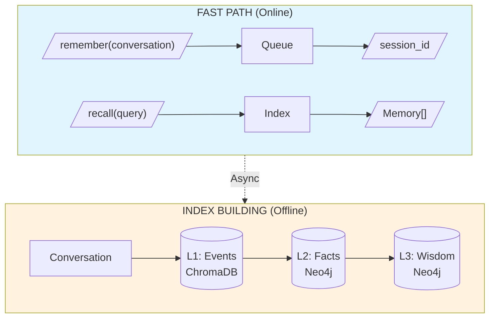

# **Cognitive Agent Memory System (CAMS) - Design Documentation**

A memory system for AI agents: **fast in, fast out, smart indexing offline**.

---

## **📚 Documentation Structure**

### **Core Documents** (Start Here)

| # | Document | Focus | Key Questions Answered |
|---|----------|-------|------------------------|
| 1 | **[Architecture](architecture.md)** ⭐ | API + Data Flow | What are the inputs/outputs? How does data flow? |
| 2 | **[Workflows](workflows.md)** ⭐ | Index Building + Maintenance | How are indexes built? How do they evolve? |

### **Reference Documents**

| # | Document | Focus | When to Read |
|---|----------|-------|--------------|
| 3 | [Interface Definitions](interfaces.md) | Data Models + APIs | When implementing |
| 4 | [Component Details](components.md) | Component Responsibilities | When debugging |
| 5 | [Acceptance Testing](acceptance-testing.md) | Test Cases | When validating |

### **Deep Dive Documents**

| # | Document | Focus | When to Read |
|---|----------|-------|--------------|
| 6 | [Design Philosophy](design-philosophy.md) | Why decisions were made | When extending |
| 7 | [Memory Provenance](provenance.md) | Version tracking | When tracing |
| 8 | [Observability](observability.md) | Metrics + Logging | When operating |

---

## **🎯 System Overview**

**Key Insight:** Skill and Principle are not independent data — they are **indexes** derived from Events to accelerate future retrieval.

---

## **📖 Reading Guide**

**If you want to...**

| Goal | Read |
|------|------|
| Understand the API | [Architecture](architecture.md) §2 |
| See how data flows | [Architecture](architecture.md) §3 |
| Learn index building | [Workflows](workflows.md) §2 |
| Understand ranking | [Workflows](workflows.md) §3 |
| Learn about forgetting | [Workflows](workflows.md) §4.4 |
| Implement a component | [Interfaces](interfaces.md) |
| Write tests | [Acceptance Testing](acceptance-testing.md) |
