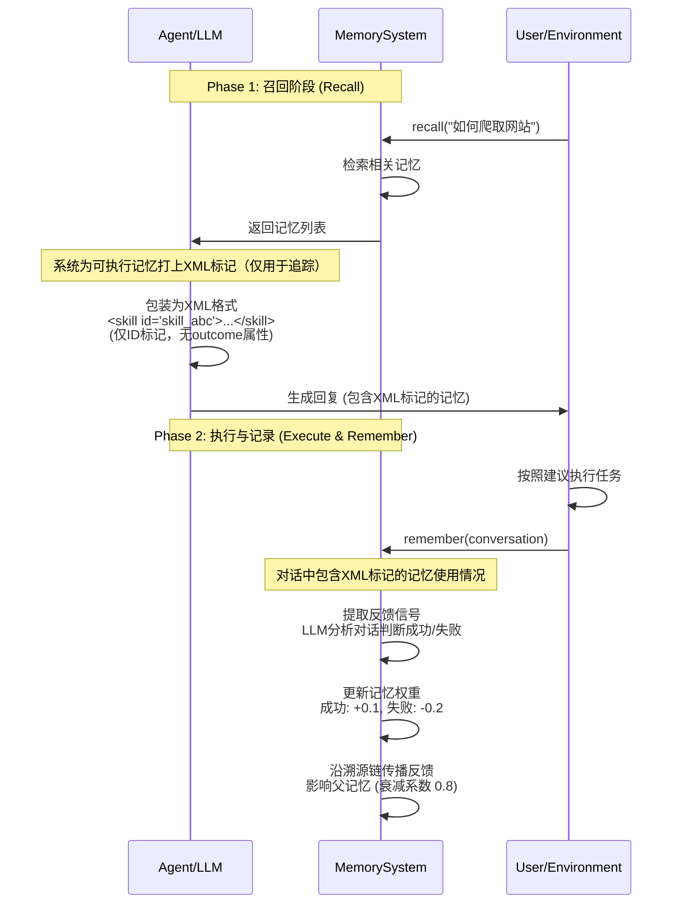

# **实现改进与设计演进 (Implementation Improvements)**

本节记录代码实现相对设计文档的改进之处，以及设计缺陷的修复历史。

## **反馈机制的完整实现 (Feedback Mechanism Implementation)**

**实现状态:** ✅ **已完成** (超越初始设计)

### **工作流程**



### **XML 标记格式**

系统在 `recall()` 返回记忆时，会为 **skill** 和 **principle** 类型的记忆自动添加 XML 标记：

**重要**: XML 标记**仅用于追踪**哪些记忆被使用，**不包含** outcome 属性。
LLM 通过分析对话语义来判断记忆使用效果，而非解析 XML 属性。

```xml
<!-- Skill 记忆标记 -->
<skill id="skill_abc123">
  Use Selenium for dynamic content: fetch_url() -> render_js() -> parse_html()
</skill>

<!-- Principle 记忆标记 -->
<principle id="principle_xyz456">
  Dynamic websites require JavaScript rendering before HTML parsing
</principle>

<!-- Episodic 记忆标记 (可选) -->
<episodic id="evt_789">
  User tried requests library but got empty response from dynamic site
</episodic>
```

### **反馈信号提取**

在 `remember()` 阶段，系统使用 **LLM 语义分析**提取反馈：

**LLM 智能推理** (主要方式):
```python
# llm.py - 分析对话语义判断记忆使用效果
def extract_feedback_signals(content: str, memory_ids: list[str]):
    """通过 LLM 分析对话内容推断记忆使用效果
    
    输入:
      - content: 完整对话文本
      - memory_ids: 被使用的记忆ID列表（从 XML 标记中提取）
    
    LLM 分析维度:
      - 显式信号: "成功了"、"失败了"、"完美解决"
      - 隐式信号: 任务完成度、错误模式、用户满意度
      - 上下文线索: 后续提问、请求替代方案、确认信息
    
    输出示例:
      [{"memory_id": "skill_abc123", "outcome": "success", "reason": "用户确认方案有效"}]
    """
```

**记忆ID追踪** (辅助方式):
```python
# retrieval_engine.py - 从对话中提取使用了哪些记忆
MEMORY_ID_PATTERN = re.compile(
    r'<(skill|principle|episodic)\s+id="([^"]+)"[^>]*>',
)

def extract_memory_ids(text: str) -> set[str]:
    """提取对话中引用的记忆ID（仅ID，无outcome）"""
```

### **权重调整策略**

| 记忆类型 | 成功信号 | 失败信号 | 说明 |
|---------|---------|---------|------|
| **Skill** | +0.1 权重<br/>+1 成功计数 | -0.1 权重<br/>+1 失败计数 | 影响未来检索排序 |
| **Principle** | +0.1 权重 | -0.2 权重 | 失败惩罚更重 |
| **Episodic** | +0.1 权重 | -0.1 权重 | 标准调整 |

### **溯源链传播 (Credit Assignment)**

反馈信号不仅影响直接使用的记忆，还会沿着 `parent_ids` 链条向上传播：

```python
# memory_system.py#L807-L860
def _propagate_feedback(memory_id, success, max_depth=3, decay_factor=0.8):
    """递归传播反馈到祖先记忆
    
    示例:
      Skill (skill_abc) 成功 → +0.1
      ↓ 衰减到 +0.08
      Principle (fact_xyz) → +0.08
      ↓ 衰减到 +0.064
      Event (evt_789) → +0.064
      ↓ 衰减到 +0.051
      Conversation (conv_original) → +0.051
    """
```

**效果:** 当一个 skill 表现良好时，生成它的 principle、提炼该 principle 的 events，以及原始对话都会得到加权，确保系统能识别出"哪些原始经历值得保留"。

### **相关文件**

- `src/hmem/core/memory_system.py#L207-L286`: `remember()` - 反馈提取入口
- `src/hmem/core/memory_system.py#L322-L358`: `_schedule_async_feedback_processing()` - LLM 反馈推理
- `src/hmem/core/memory_system.py#L360-L396`: `_apply_feedback()` - 权重调整逻辑
- `src/hmem/core/memory_system.py#L807-L860`: `_propagate_feedback()` - 溯源链传播
- `src/hmem/agents/llm.py#L276-L325`: `extract_feedback_signals()` - LLM 推理实现
- `src/hmem/hippocampus/retrieval_engine.py#L36-L89`: XML 解析实现

---

## **Neo4j 语义存储迁移 (Neo4j Semantic Store Migration)**

**完成时间:** 2026-01-11  
**原因:** 解决 SQLite LIKE 查询的语义匹配限制

### **迁移前问题**

设计文档原本使用 SQLite 三元组表存储语义事实：

```sql
-- 旧方案: SQLite + LIKE 查询
SELECT * FROM semantic_triples 
WHERE subject LIKE '%user%' 
   OR object LIKE '%preference%';
```

**局限性:**
- ❌ 查询 "What are my food preferences?" 无法匹配 `("I", "do not eat", "meat")`
- ❌ 无法处理同义词 ("diet" vs "food")
- ❌ 不支持多跳关系推理 ("Alice" → "likes" → "Python" → "used for" → "web scraping")

### **迁移后方案**

Neo4j 原生图数据库 + Cypher 查询 + 向量索引：

```cypher
// 支持语义查询
MATCH (u:Entity {name: "user"})-[r:RELATION]->(o:Entity)
WHERE r.predicate CONTAINS "prefer" OR r.predicate CONTAINS "like"
RETURN u, r, o

// 支持多跳推理
MATCH path = (start)-[*1..3]-(end)
WHERE start.name = "Alice"
RETURN path

// 支持向量相似度查询 (Neo4j 5.x+)
CALL db.index.vector.queryNodes('semantic_vectors', 5, $embedding)
YIELD node, score
```

### **迁移收益**

| 能力 | SQLite | Neo4j |
|------|--------|-------|
| **文本匹配** | ✅ LIKE 查询 | ✅ 全文索引 + 向量索引 |
| **图遍历** | ❌ 需要递归 CTE | ✅ 原生 Cypher 支持 |
| **多跳推理** | ⚠️ 性能差 | ✅ 高效 (索引优化) |
| **语义相似度** | ❌ 不支持 | ✅ 向量插件支持 |
| **事务支持** | ✅ ACID | ✅ ACID |
| **部署复杂度** | ✅ 单文件 | ⚠️ 需要独立服务 |

### **配置示例**

```yaml
# config/memory.yaml
storage:
  semantic_backend: "neo4j"  # 或 "sqlite" (向后兼容)
  neo4j_uri: "bolt://localhost:7687"
  neo4j_username: "neo4j"
  neo4j_password: "password"
  neo4j_database: "neo4j"
```

---

## **Implementation Gap Analysis: Design vs Reality (2026-01-13)**

This section analyzes the current implementation against the design documentation to identify naive implementations that may not work well in real-world operational scenarios (e.g., root cause analysis during incidents, scattered business knowledge, diverse data sources).

### **Executive Summary**

The current implementation has solid foundational architecture but contains several critical gaps that would cause issues in production operational/maintenance scenarios:

| Priority | Issue | Location | Impact |
|----------|-------|----------|--------|
| 🔴 P0 | Naive hash-based embeddings | `utils/embeddings.py` | Topic clustering and semantic search produce unreliable results |
| 🔴 P0 | No multi-source knowledge correlation | Missing | Cannot correlate logs, metrics, configs, incidents |
| 🟡 P1 | Naive topic extraction | `topic_extraction.py` | Fails with bursty operational data |
| 🟡 P1 | Weak conflict resolution | `neo4j_semantic.py` | Loses temporal context of knowledge evolution |
| 🟡 P1 | Missing temporal causality | Missing | Cannot answer "what changed before the failure?" |
| 🟡 P2 | Limited cross-session correlation | `memory_system.py` | Each session is isolated |
| 🟡 P2 | Naive feedback extraction | `llm.py` | Over-reliance on explicit XML markers |

### **Critical Gap #1: Naive Embedding Implementation**

**Location:** `src/hmem/utils/embeddings.py`

**Current Implementation:**
```python
def embed(self, text: str) -> np.ndarray:
    # Hash-based embedding - NO semantic understanding
    text_hash = hashlib.md5(text.encode()).hexdigest()
    seed = int(text_hash[:8], 16)
    return rng.randn(self.dim).astype(np.float32)
```

**Problem:** Hash-based embeddings have **zero semantic similarity**. "database error" and "DB crash" produce completely unrelated vectors. In operational scenarios:
- "memory leak", "OOM", "out of memory" must cluster together
- "timeout on service A" must relate to "high latency in service A"

**Impact:**
- Topic clustering produces meaningless clusters
- Semantic search fails to find related incidents
- Principle induction from episodes is unreliable

**Recommendation:** Replace with sentence-transformers or OpenAI embeddings:
```python
from sentence_transformers import SentenceTransformer

class SemanticEmbeddingGenerator:
    def __init__(self, model_name: str = "all-MiniLM-L6-v2"):
        self.model = SentenceTransformer(model_name)
    
    def embed(self, text: str) -> np.ndarray:
        return self.model.encode(text)
```

### **Critical Gap #2: Missing Multi-Source Knowledge Correlation**

**Design Promise (from architecture.md):** "Business knowledge is scattered, data sources are diverse"

**Current Reality:** Each `Conversation` is processed independently with no mechanism to correlate:
- Metrics data (CPU, memory, latency)
- Log patterns
- Configuration changes
- Previous incident resolutions
- Runbook knowledge

**Missing Components:**
```python
class KnowledgeSource(Protocol):
    source_type: str  # "metrics", "logs", "runbook", "incident", "config"
    def extract_events(self, time_range: TimeRange) -> list[Event]: ...
    def correlate_with(self, other: "KnowledgeSource") -> list[SemanticTriple]: ...

class MultiSourceEncoder:
    def correlate_incident(
        self,
        incident_time: datetime,
        context_window: timedelta,
        sources: list[KnowledgeSource]
    ) -> CorrelatedKnowledge: ...
```

### **Major Gap #3: Naive Topic Extraction for Incident Patterns**

**Location:** `src/hmem/hippocampus/topic_extraction.py`

**Problems:**
1. **Uniform density assumption** - Real operational data has bursty patterns
2. **No time-awareness** - Events 5 minutes apart during an incident are related
3. **No severity weighting** - Critical incidents should weight higher
4. **Fixed min_cluster_size** - Critical incidents might only have 2-3 events

**Recommendation:**
```python
class IncidentAwareTopicExtractor:
    def extract_topics(
        self,
        episodes: list[Event],
        temporal_window: timedelta = timedelta(hours=1),
        severity_weights: dict[str, float] = None
    ) -> list[TopicCluster]: ...
```

### **Major Gap #4: Weak Conflict Resolution for Knowledge Evolution**

**Location:** `src/hmem/storage/neo4j_semantic.py:resolve_conflict()`

**Current:** Simply supersedes old with new, losing:
- **Temporal context** - "timeout was 5s" replaced by "timeout is 10s" without WHEN
- **Confidence aggregation** - 10 events saying "5s" vs 1 saying "10s" → single wins
- **Change causality** - WHY did configuration change?

**For Root Cause Analysis, we need:**
- Configuration BEFORE the failure
- Recent configuration changes
- What triggered those changes

### **Major Gap #5: Missing Temporal Causality for Incident Analysis**

**Scenario:** During an incident at 14:30:
- 14:25 - Config change deployed
- 14:28 - Memory usage spike
- 14:30 - Service timeout
- 14:32 - Error rate spike

**Current System Cannot:**
1. Automatically correlate these events temporally
2. Infer potential causal chains
3. Query "what changed before the failure?"

**Missing Component:**
```python
class TemporalCausalityEngine:
    def build_incident_timeline(
        self, anchor_event: Event, lookback: timedelta, lookahead: timedelta
    ) -> IncidentTimeline: ...
    
    def find_potential_causes(
        self, effect_event: Event, max_time_gap: timedelta
    ) -> list[CausalCandidate]: ...
```

### **Medium Gap #6: Limited Cross-Session Correlation**

**Problem:** Each session is isolated. Knowledge builds across sessions:
- Session 1: "Investigated memory leak in service A"
- Session 2: "Fixed memory leak by updating library X"  
- Session 3 (weeks later): "Memory leak returned"

The system should link Session 3 to 1 and 2 automatically.

### **Medium Gap #7: Naive Feedback Extraction**

**Location:** `src/hmem/agents/llm.py:extract_feedback_signals()`

**Problems:**
1. **Requires explicit XML marking** - Operational feedback is often implicit
2. **No outcome tracking from external systems** - Did the fix actually work?
3. **No time-delayed feedback** - Suggestion might fail hours later

### **Priority Action Items**

**Immediate (P0):**
1. Replace hash embeddings with semantic embeddings (1 day effort)
2. Add temporal awareness to retrieval with `time_range` filter (0.5 days)

**Short-term (P1):**
3. Implement temporal causality engine (2-3 days)
4. Enhance conflict resolution with temporal validity (1-2 days)
5. Add cross-session correlation (1-2 days)

**Medium-term (P2):**
6. Multi-source knowledge integration framework (3-5 days)
7. Operational query understanding (2-3 days)
8. Outcome tracking with external verification (2-3 days)

### **Testing Recommendations**

```python
def test_incident_root_cause_analysis():
    """
    Given: A sequence of events leading to an incident
    When: User asks "why did service A fail?"
    Then: System should retrieve:
        - Recent configuration changes
        - Related error events
        - Previous similar incidents
        - Relevant principles about this service
    """
    pass

def test_recurring_incident_detection():
    """
    Given: An incident that occurred before was resolved
    When: Similar symptoms appear again
    Then: System should recognize the pattern and suggest previous fix
    """
    pass
```

---

**关联文档：**
- [系统设计理念](design.md) - 设计哲学和核心概念
- [核心流程](workflows.md) - 流程 4 (反馈驱动的权重更新与精炼)
