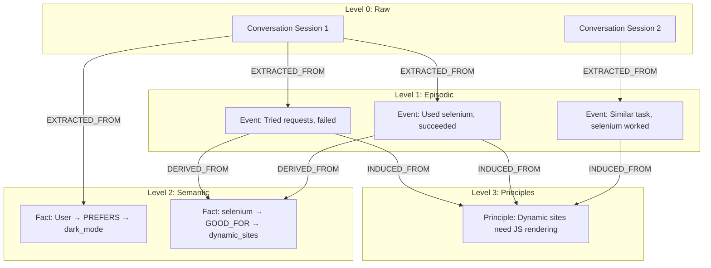

# **记忆溯源与层次语义图 (Memory Lineage & Hierarchical Semantic Graph)**

为实现可追溯的反思机制，系统采用**记忆溯源 (Memory Lineage)** 架构，建立父子记忆关联。

## **核心概念**

1. **原始记忆 (Raw Memory):** 直接来自对话/环境的原始输入
2. **派生记忆 (Derived Memory):** 从原始记忆或其他记忆中提炼出的知识
3. **溯源链 (Provenance Chain):** 记忆之间的父子关系链
4. **层次语义图 (Hierarchical Semantic Graph):** 记忆节点及其关联形成的多层图结构

## **层次结构**

```
Level 0: Raw Conversation / Observation
    ↓ (extraction)
Level 1: Episodic Events (Task-Action-Result)
    ↓ (extraction)
Level 2: Semantic Facts (Entity-Relation-Entity)
    ↓ (induction across multiple Level 1/2 memories)
Level 3: Principles / Rules (Abstract knowledge)
```

## **溯源关系类型**

| 关系类型 | 含义 | 示例 |
|----------|------|------|
| EXTRACTED_FROM | 从原始记录中提取 | Event → Conversation |
| DERIVED_FROM | 从其他记忆推导 | Fact → Event |
| INDUCED_FROM | 从多个记忆归纳 | Principle → [Event1, Event2, Event3] |
| SUPERSEDES | 更新/替代旧记忆 | NewFact → OldFact |

## **数据模型扩展**

所有记忆节点包含以下溯源字段：
- `memory_id`: 唯一标识符
- `parent_ids`: 父记忆ID列表（可有多个父节点）
- `derivation_type`: 派生类型 (extraction/derivation/induction/supersession)

## **溯源图示例**



## **反思时的溯源使用**

当反思 Agent 生成新原则时：
1. 收集相似的 Episodic Events
2. 记录 `parent_ids = [event1.id, event2.id, ...]`
3. 设置 `derivation_type = "induction"`
4. 生成的 Principle 可追溯到原始证据

## **冲突解决时的溯源使用**

当检测到语义冲突时：
1. 创建新记忆，`parent_ids` 包含旧记忆 ID
2. 设置 `derivation_type = "supersession"`
3. 保留完整历史，支持时间旅行查询

## **溯源链应用场景**

### **场景 1: 权重反馈传播**

当一个 Skill 使用成功时，不仅该 Skill 权重增加，生成它的 Principle 也会受益：

```
Session 1: User asks "如何爬动态网站"
  └─> Agent recall Skill v1: "Use Selenium with explicit waits"
      └─> Agent uses it → Success ✓
          └─> Consolidate: Update weights
              ├─ Skill "Use Selenium..." weight += 0.1
              ├─ Principle "Dynamic sites need JS" weight += 0.08 (衰减)
              └─ Original Event "Used selenium, succeeded" weight += 0.05 (衰减)
```

### **场景 2: 精炼版本回溯**

当一个 Skill 精炼后，系统保留完整的版本链以支持回滚：

```
Skill v1: "Use requests for web scraping"
  ├─ version: v1
  ├─ weight: 2.0 (低，因为动态网站失败多)
  ├─ usage_count: 15
  ├─ success_count: 5 (success_rate: 33%)
  └─ Reflection Agent triggers refinement...

Skill v2: "Use requests for static sites, Selenium for dynamic"
  ├─ version: v2
  ├─ predecessor_id: skill_v1_id
  ├─ parent_ids: [skill_v1_id] (溯源链)
  ├─ derivation_type: "refinement"
  ├─ weight: 1.0 (reset, 等待新反馈)
  └─ change_reason: "低成功率 (33%) 和高失败占比 (67%)"

// Agent 的选择逻辑
if skill_v2.created_at > recent_date:
    use skill_v2  # 优先使用新版本
else:
    use skill_v1 if skill_v1.weight > threshold else fallback
```

### **场景 3: 知识演进追踪**

通过溯源链可以追踪某个知识点的演进历史：

```
Query: "这个 Principle 的由来是什么？"
  └─> Principle P1 (v2): "Always validate user input before processing"
      ├─ induced_from: [Event1, Event2, Event3, Event4]
      ├─ version_history:
      │   ├─ v1: "Validate user input" (too vague)
      │   └─ v2: "Always validate user input before processing" (refined)
      └─ Evidence trail:
          ├─ Event1: SQL injection attack prevented by validation
          ├─ Event2: XSS attack prevented by validation
          ├─ Event3: Similar Principle from another agent session
          └─ Event4: New failure case discovered, requires refinement
```

---

**关联文档：**
- [系统设计理念](design.md) - 设计哲学和核心概念
- [核心流程](workflows.md) - 流程 4 (反馈驱动的权重更新与精炼)
- [接口定义](interfaces.md) - 数据模型的完整定义
