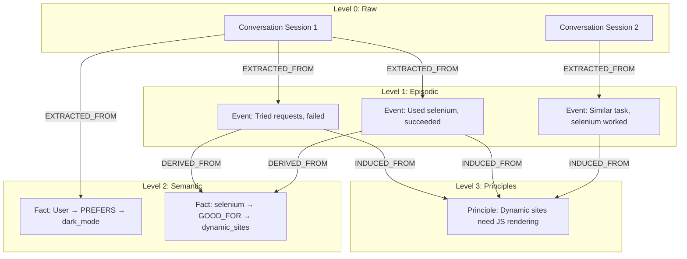

# **Memory Provenance & Hierarchical Semantic Graph**

To implement traceable reflection mechanisms, the system adopts a **memory provenance** architecture, establishing parent-child memory associations.

## **Core Concepts**

1. **Raw Memory:** Direct input from conversations/environment
2. **Derived Memory:** Knowledge refined from raw memory or other memories
3. **Provenance Chain:** Parent-child relationships between memories
4. **Hierarchical Semantic Graph:** Multi-layer graph structure formed by memory nodes and their associations

## **Hierarchical Structure**

```
Level 0: Raw Conversation / Observation
    ↓ (extraction)
Level 1: Episodic Events (Task-Action-Result)
    ↓ (extraction)
Level 2: Semantic Facts (Entity-Relation-Entity)
    ↓ (induction across multiple Level 1/2 memories)
Level 3: Principles / Rules (Abstract knowledge)
```

## **Provenance Relationship Types**

| Relationship Type | Meaning | Example |
|----------|------|------|
| EXTRACTED_FROM | Extracted from raw record | Event → Conversation |
| DERIVED_FROM | Derived from other memories | Fact → Event |
| INDUCED_FROM | Induced from multiple memories | Principle → [Event1, Event2, Event3] |
| SUPERSEDES | Updates/replaces old memory | NewFact → OldFact |

## **Data Model Extension**

All memory nodes contain the following provenance fields:
- `memory_id`: Unique identifier
- `parent_ids`: List of parent memory IDs (can have multiple parents)
- `derivation_type`: Derivation type (extraction/derivation/induction/supersession)

## **Provenance Graph Example**



## **Provenance Usage in Reflection**

When the Reflection Agent generates new principles:
1. Collect similar Episodic Events
2. Record `parent_ids = [event1.id, event2.id, ...]`
3. Set `derivation_type = "induction"`
4. Generated Principle is traceable to original evidence

## **Provenance Usage in Conflict Resolution**

When semantic conflicts are detected:
1. Create new memory with `parent_ids` containing old memory ID
2. Set `derivation_type = "supersession"`
3. Preserve complete history, support time-travel queries

## **Provenance Chain Application Scenarios**

### **Scenario 1: Weight Feedback Propagation**

When a Skill is used successfully, not only does the Skill's weight increase, but the Principle that generated it also benefits:

```
Session 1: User asks "How to scrape dynamic websites"
  └─> Agent recall Skill v1: "Use Selenium with explicit waits"
      └─> Agent uses it → Success ✓
          └─> Consolidate: Update weights
              ├─ Skill "Use Selenium..." weight += 0.1
              ├─ Principle "Dynamic sites need JS" weight += 0.08 (decay)
              └─ Original Event "Used selenium, succeeded" weight += 0.05 (decay)
```

### **Scenario 2: Refinement Version Backtracking**

When a Skill is refined, the system preserves complete version chain for rollback support:

```
Skill v1: "Use requests for web scraping"
  ├─ version: v1
  ├─ weight: 2.0 (low, because dynamic sites fail frequently)
  ├─ usage_count: 15
  ├─ success_count: 5 (success_rate: 33%)
  └─ Reflection Agent triggers refinement...

Skill v2: "Use requests for static sites, Selenium for dynamic"
  ├─ version: v2
  ├─ predecessor_id: skill_v1_id
  ├─ parent_ids: [skill_v1_id] (provenance chain)
  ├─ derivation_type: "refinement"
  ├─ weight: 1.0 (reset, waiting for new feedback)
  └─ change_reason: "Low success rate (33%) and high failure ratio (67%)"

// Agent's selection logic
if skill_v2.created_at > recent_date:
    use skill_v2  # Prioritize new version
else:
    use skill_v1 if skill_v1.weight > threshold else fallback
```

### **Scenario 3: Knowledge Evolution Tracking**

Through provenance chain, trace the evolution history of knowledge:

```
Query: "What is the origin of this Principle?"
  └─> Principle P1 (v2): "Always validate user input before processing"
      ├─ induced_from: [Event1, Event2, Event3, Event4]
      ├─ version_history:
      │   ├─ v1: "Validate user input" (too vague)
      │   └─ v2: "Always validate user input before processing" (refined)
      └─ Evidence trail:
          ├─ Event1: SQL injection attack prevented by validation
          ├─ Event2: XSS attack prevented by validation
          ├─ Event3: Similar Principle from another agent session
          └─ Event4: New failure case discovered, requires refinement
```

---

**Related Documents:**
- [System Design Philosophy](design.md) - Design philosophy and core concepts
- [Core Workflows](workflows.md) - Workflow 4 (feedback-driven weight updates & refinement)
- [Interface Definitions](interfaces.md) - Complete definition of data models
