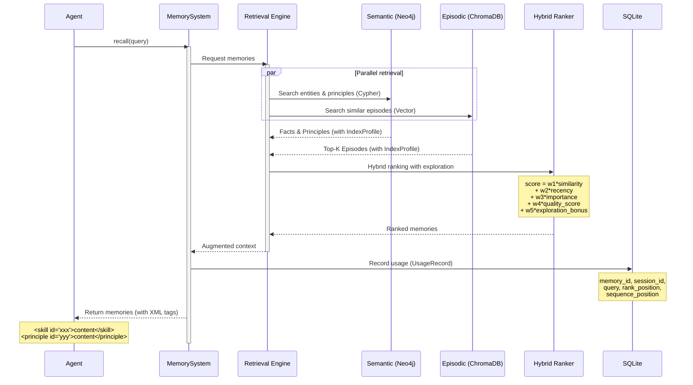
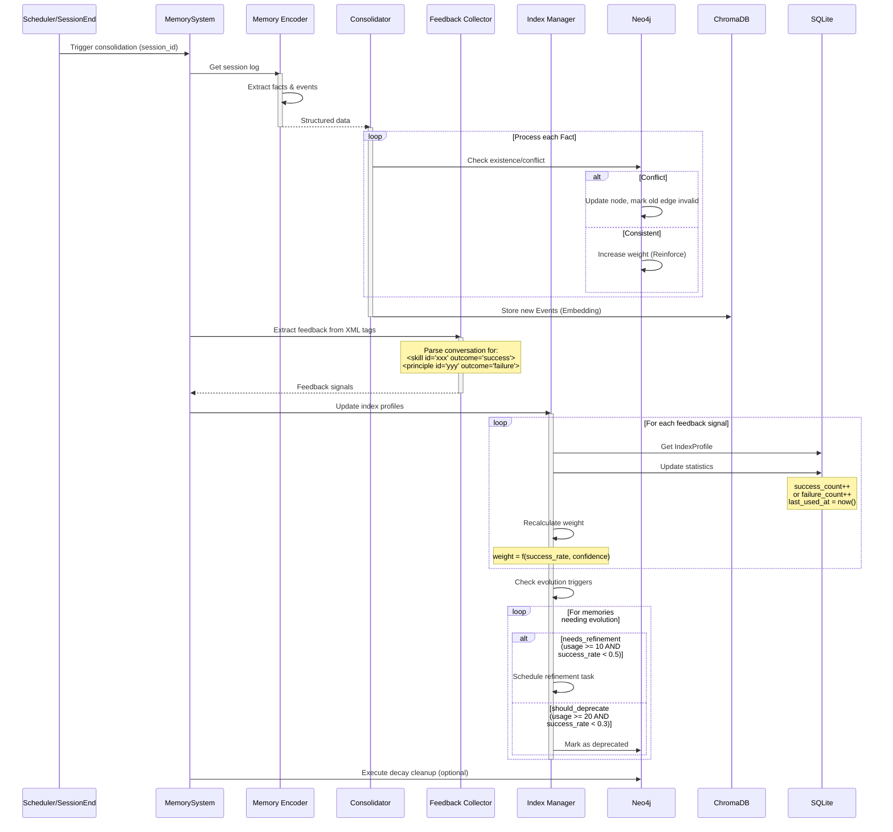
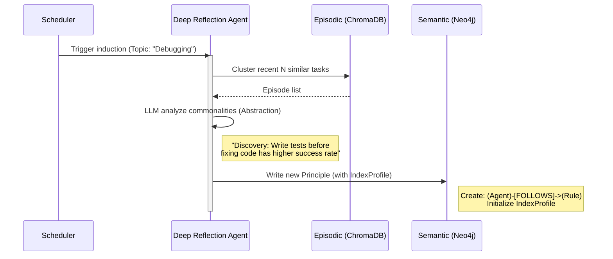
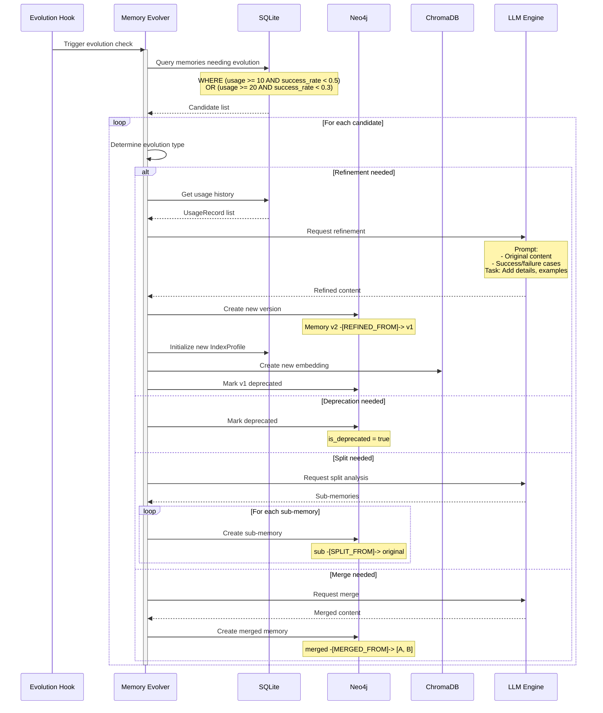
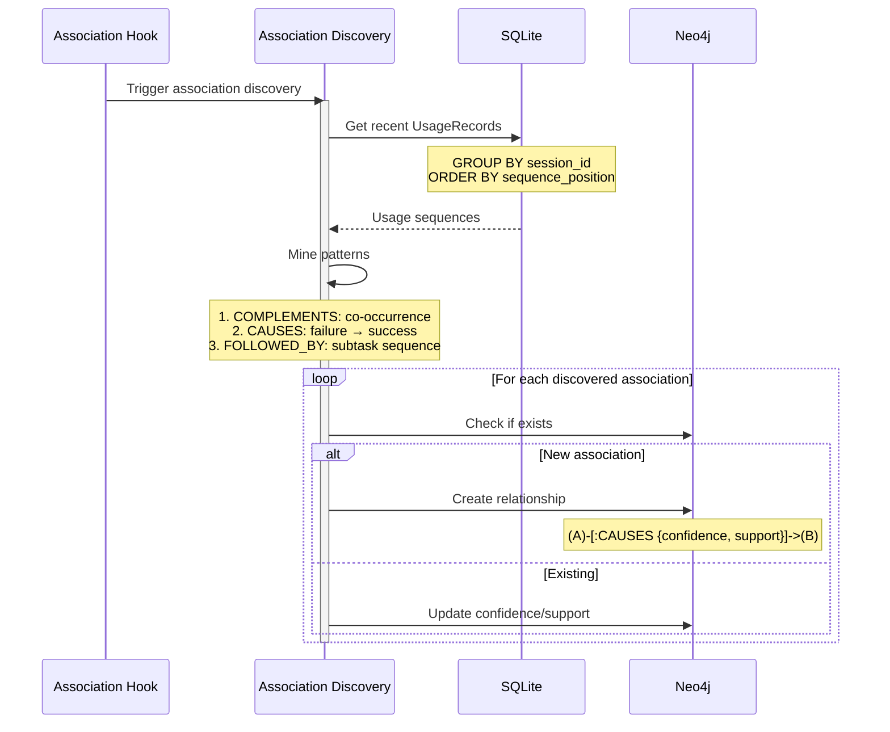
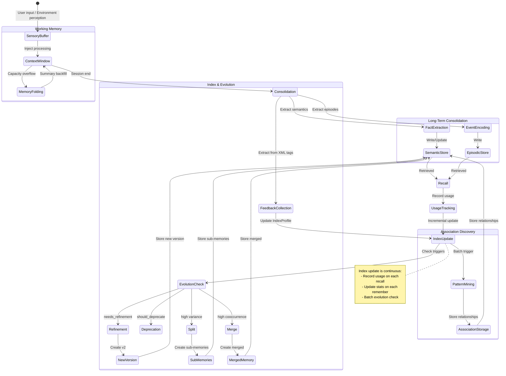

# **Core Workflows**

## **Workflow 1: Hot Path - Retrieval with Exploration (The Retrieval Loop)**

*Scenario: Agent is generating a response. Supports progressive result return.*

**Key Features: Hybrid ranking + Adaptive exploration + Usage recording**

**Two-Phase Design:**
- **Phase 1 (Sync fast retrieval):** Query memory cache + Bloom Filter, P95 < 50ms
- **Phase 2 (Async deep retrieval):** Vector similarity + Graph queries, P95 < 500ms



**Key Components:**

### **Hybrid Ranker with Exploration**

```python
class HybridRankerWithExploration:
    """Ranking with adaptive exploration"""

    def rank(self, candidates: list[Memory], query: str) -> list[Memory]:
        for mem in candidates:
            quality_score = 0.5
            exploration_bonus = 0.0

            if mem.index_profile:
                quality_score = mem.index_profile.quality_score
                # Lower usage = higher exploration bonus
                exploration_bonus = 1.0 / (1 + log(1 + mem.index_profile.usage_count))

            mem.score = (
                0.4 * mem.score +           # similarity
                0.15 * recency_score +       # recency
                0.15 * importance_score +    # importance
                0.2 * quality_score +        # quality (from IndexProfile)
                0.1 * exploration_bonus      # exploration
            )

        return sorted(candidates, key=lambda m: m.score, reverse=True)
```

### **Adaptive Exploration Rate**

```python
def get_exploration_rate(total_usage: int) -> float:
    """
    Adaptive exploration rate:
    - Early (small knowledge base): ~20% exploration
    - Late (mature knowledge base): ~5% exploration
    """
    initial_rate = 0.2
    min_rate = 0.05
    decay_threshold = 1000

    decay_factor = total_usage / decay_threshold
    return max(min_rate, initial_rate / (1 + decay_factor))
```

---

## **Workflow 2: Cold Path - Consolidation & Index Update (The Consolidation Loop)**

*Scenario: After conversation ends or during system idle. Async execution.*

**Key Features: Feedback collection from XML tags + Index update + Evolution trigger check**



**Key Components:**

### **Feedback Collector**

```python
class FeedbackCollector:
    """Extract feedback from XML-tagged conversation"""

    def extract_feedback(self, conversation: Conversation) -> list[FeedbackSignal]:
        """
        Parse conversation for feedback signals.
        XML format: <skill id="xxx" outcome="success">content</skill>
        """
        signals = []
        full_text = "\n".join(m.content for m in conversation.messages)

        # Regex to find tagged memories with outcomes
        pattern = r'<(skill|principle|memory)\s+id="([^"]+)"[^>]*outcome="(success|failure)"'

        for match in re.finditer(pattern, full_text):
            source_type, memory_id, outcome = match.groups()
            signals.append(FeedbackSignal(
                memory_id=memory_id,
                outcome=outcome,
                source_type=source_type
            ))

        return signals
```

### **Index Manager**

```python
class IndexManager:
    """Manage IndexProfile updates and evolution triggers"""

    def update_from_feedback(
        self,
        session_id: str,
        signals: list[FeedbackSignal]
    ) -> IndexUpdateResult:
        """Update index profiles based on feedback"""

        for signal in signals:
            profile = self.sql_store.get_profile(signal.memory_id)

            # Update statistics
            profile.usage_count += 1
            profile.last_used_at = datetime.now()

            if signal.outcome == "success":
                profile.success_count += 1
                profile.last_success_at = datetime.now()
            elif signal.outcome == "failure":
                profile.failure_count += 1

            # Recalculate weight
            profile.weight = self._calculate_weight(profile)

            self.sql_store.update_profile(signal.memory_id, profile)

        # Check evolution triggers
        return self._check_evolution_triggers(signals)

    def _calculate_weight(self, profile: IndexProfile) -> float:
        """Calculate weight from statistics"""
        base_weight = 1.0
        quality_factor = profile.quality_score  # success_rate * confidence

        # Weight range: [0.1, 10.0]
        return max(0.1, min(10.0, base_weight + quality_factor * 9.0))
```

---

## **Workflow 3: Evolution Path - Induction & Philosophy Extraction (The Induction Loop)**

*Scenario: Periodically (e.g., weekly) or after N task accumulations.*



---

## **Workflow 4: Memory Evolution (Refinement, Split, Merge, Deprecate)**

*Scenario: When evolution triggers are met. Async execution.*

**Evolution Types:**

| Type | Description | Trigger Condition | Result |
|------|-------------|-------------------|--------|
| **Refinement** | Add details | `usage >= 10 AND success_rate < 0.5` | v1 → v2 |
| **Split** | Break into smaller pieces | `usage >= 10 AND high variance` | v1 → [v1a, v1b] |
| **Merge** | Combine related memories | `cooccurrence_rate > 0.8` | [A, B] → C |
| **Deprecate** | Mark as obsolete | `usage >= 20 AND success_rate < 0.3` | deprecated = true |



### **Evolution Hook Interface**

```python
class EvolutionTriggerHook(ABC):
    """Configurable evolution trigger strategy"""

    @abstractmethod
    def should_trigger(self, stats: SystemStats) -> bool:
        pass


class BatchEvolutionHook(EvolutionTriggerHook):
    """Trigger every N remembers"""

    def __init__(self, batch_size: int = 50):
        self.batch_size = batch_size

    def should_trigger(self, stats: SystemStats) -> bool:
        return stats.remember_count % self.batch_size == 0
```

### **Version Evolution Graph (Neo4j)**

```cypher
// Refinement relationship
(:Memory {id: "skill_001_v2"})-[:REFINED_FROM]->(:Memory {id: "skill_001_v1"})

// Split relationship
(:Memory {id: "skill_001a"})-[:SPLIT_FROM]->(:Memory {id: "skill_001"})
(:Memory {id: "skill_001b"})-[:SPLIT_FROM]->(:Memory {id: "skill_001"})

// Merge relationship
(:Memory {id: "skill_003"})-[:MERGED_FROM]->(:Memory {id: "skill_001"})
(:Memory {id: "skill_003"})-[:MERGED_FROM]->(:Memory {id: "skill_002"})

// Query version history
MATCH path = (current:Memory)-[:REFINED_FROM|SPLIT_FROM*]->(ancestor:Memory)
WHERE current.id = $memory_id
RETURN path
```

---

## **Workflow 5: Association Discovery**

*Scenario: Periodically (e.g., every 50 remembers or weekly).*

**Association Types:**

| Type | Meaning | Detection | Neo4j |
|------|---------|-----------|-------|
| **CAUSES** | A failed → B succeeded | Sequential pattern | `(A)-[:CAUSES]->(B)` |
| **COMPLEMENTS** | A and B used together | Co-occurrence | `(A)-[:COMPLEMENTS]-(B)` |
| **FOLLOWED_BY** | A then B (subtask order) | Sequential pattern | `(A)-[:FOLLOWED_BY]->(B)` |



### **Simple Association Discovery**

```python
class SimpleAssociationDiscovery:
    """Simple statistics-based association discovery"""

    def discover(
        self,
        usage_records: list[UsageRecord],
        min_support: int = 3
    ) -> list[Association]:
        associations = []
        sessions = self._group_by_session(usage_records)

        # 1. COMPLEMENTS: same subtask, both successful
        cooccurrence = Counter()
        for session in sessions.values():
            subtask_groups = self._group_by_subtask(session)
            for records in subtask_groups.values():
                successful = [r for r in records if r.outcome == "success"]
                for a, b in combinations(successful, 2):
                    pair = tuple(sorted([a.memory_id, b.memory_id]))
                    cooccurrence[pair] += 1

        for (a, b), count in cooccurrence.items():
            if count >= min_support:
                associations.append(Association(
                    source_id=a, target_id=b,
                    relation_type="COMPLEMENTS",
                    confidence=count / len(sessions),
                    support=count
                ))

        # 2. CAUSES: A failed → B succeeded
        # 3. FOLLOWED_BY: sequential subtasks
        # ... similar logic

        return associations
```

### **Association-Aware Retrieval**

```python
class AssociationAwareRetrieval:
    """Enhance retrieval with discovered associations"""

    def enhance_results(
        self,
        base_results: list[Memory],
        query: str
    ) -> list[Memory]:
        enhanced = list(base_results)
        seen_ids = {m.id for m in base_results}

        # For top results, find complementary memories
        for memory in base_results[:3]:
            complements = self.graph_store.get_complements(memory.id)
            for comp in complements:
                if comp.id not in seen_ids:
                    comp.score *= 0.8  # Slightly lower score
                    enhanced.append(comp)
                    seen_ids.add(comp.id)

        return sorted(enhanced, key=lambda m: m.score, reverse=True)
```

---

## **Memory Lifecycle State Diagram**



---

## **Three Storage Responsibilities**

### **SQLite - High-frequency structured data**

```sql
-- IndexProfile table
CREATE TABLE index_profiles (
    memory_id TEXT PRIMARY KEY,
    usage_count INTEGER DEFAULT 0,
    success_count INTEGER DEFAULT 0,
    failure_count INTEGER DEFAULT 0,
    weight REAL DEFAULT 1.0,
    first_used_at TIMESTAMP,
    last_used_at TIMESTAMP,
    last_success_at TIMESTAMP
);

-- UsageRecord table
CREATE TABLE usage_records (
    id TEXT PRIMARY KEY,
    memory_id TEXT NOT NULL,
    session_id TEXT NOT NULL,
    subtask_id TEXT,
    sequence_position INTEGER DEFAULT 0,
    query TEXT NOT NULL,
    rank_position INTEGER,
    outcome TEXT DEFAULT 'unknown',
    used_at TIMESTAMP DEFAULT CURRENT_TIMESTAMP,
    INDEX idx_memory_used (memory_id, used_at),
    INDEX idx_session (session_id)
);
```

### **Neo4j - Graph relationships**

```cypher
// Memory node
(:Memory {
    id: "skill_001_v2",
    content: "...",
    version: 2,
    is_deprecated: false
})

// Version relationships
(:Memory)-[:REFINED_FROM]->(:Memory)
(:Memory)-[:SPLIT_FROM]->(:Memory)
(:Memory)-[:MERGED_FROM]->(:Memory)

// Association relationships
(:Memory)-[:CAUSES {confidence, support}]->(:Memory)
(:Memory)-[:COMPLEMENTS {confidence}]-(:Memory)
(:Memory)-[:FOLLOWED_BY {probability}]->(:Memory)
```

### **ChromaDB - Vector retrieval**

```python
# Collection: memory_content
{
    "id": "skill_001_v2",
    "embedding": [0.1, 0.3, ...],
    "metadata": {"source": "skill", "version": 2}
}
```

---

## **Index Refresh Timing Summary**

| Timing | Operation | Frequency | Storage |
|--------|-----------|-----------|---------|
| **Immediate (recall)** | Create UsageRecord | Each recall | SQLite |
| **Immediate (remember)** | Extract feedback from XML | Each remember | - |
| **Short-term (post-remember)** | Update IndexProfile | Each consolidation | SQLite |
| **Medium-term (batch)** | Evolution check & execution | Every N remembers | All |
| **Medium-term (batch)** | Association discovery | Every N remembers | Neo4j |
| **Long-term (periodic)** | Cleanup low-quality memories | Weekly | All |

---

**Related Documents:**
- [System Design Philosophy](design.md) - Design philosophy and core concepts
- [System Architecture](architecture.md) - Overall architecture and technical choices
- [Component Details](components.md) - Component responsibilities and implementations
- [Key Interface Definitions](interfaces.md) - Data models and API interfaces
- [Memory Provenance](provenance.md) - Memory provenance and hierarchical semantic graph
