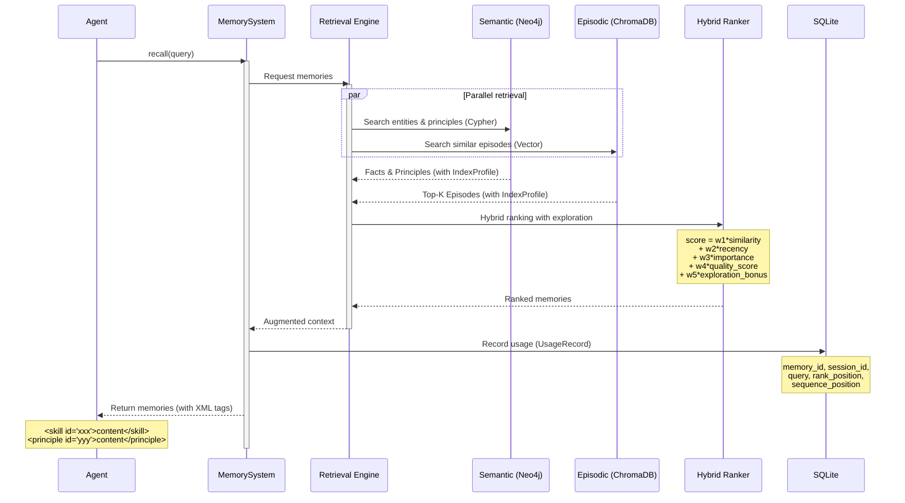
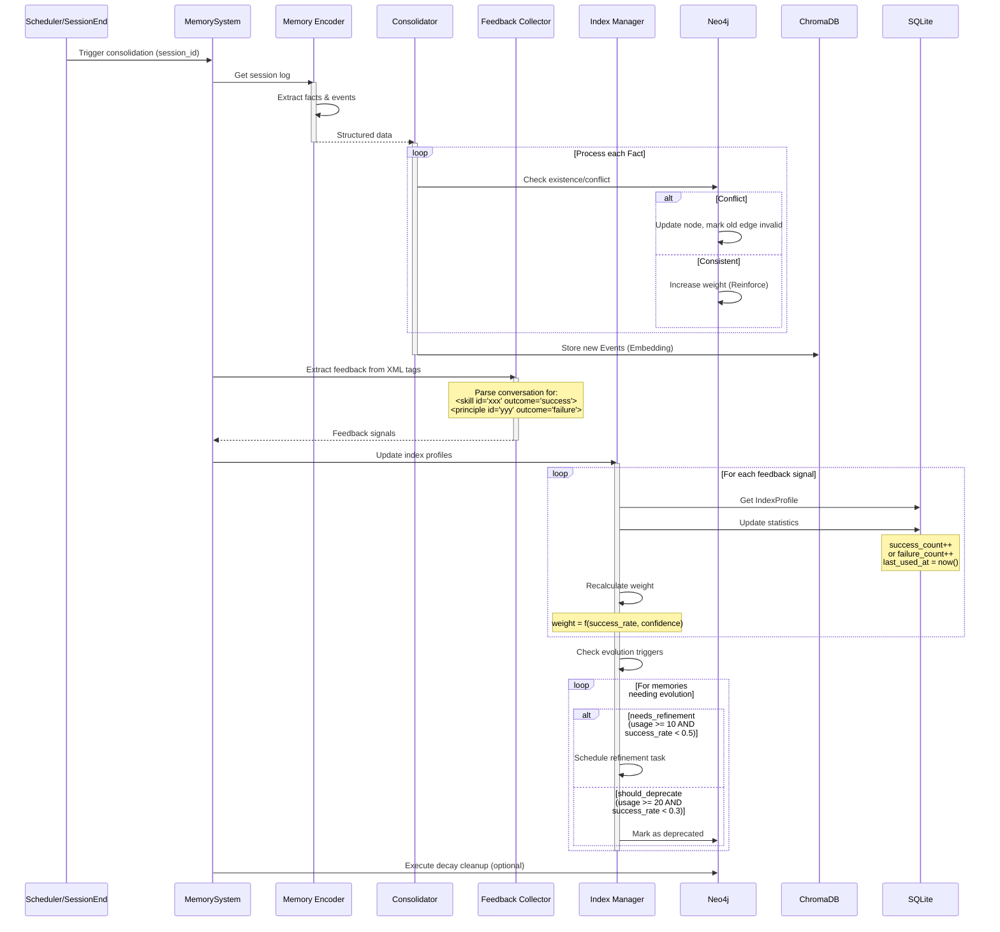
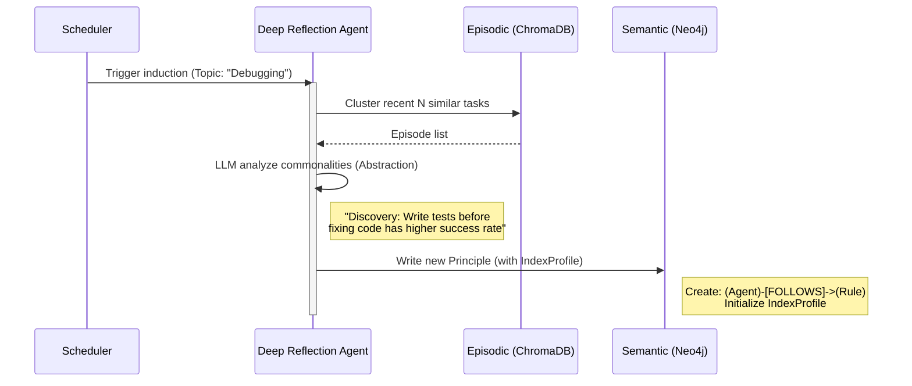
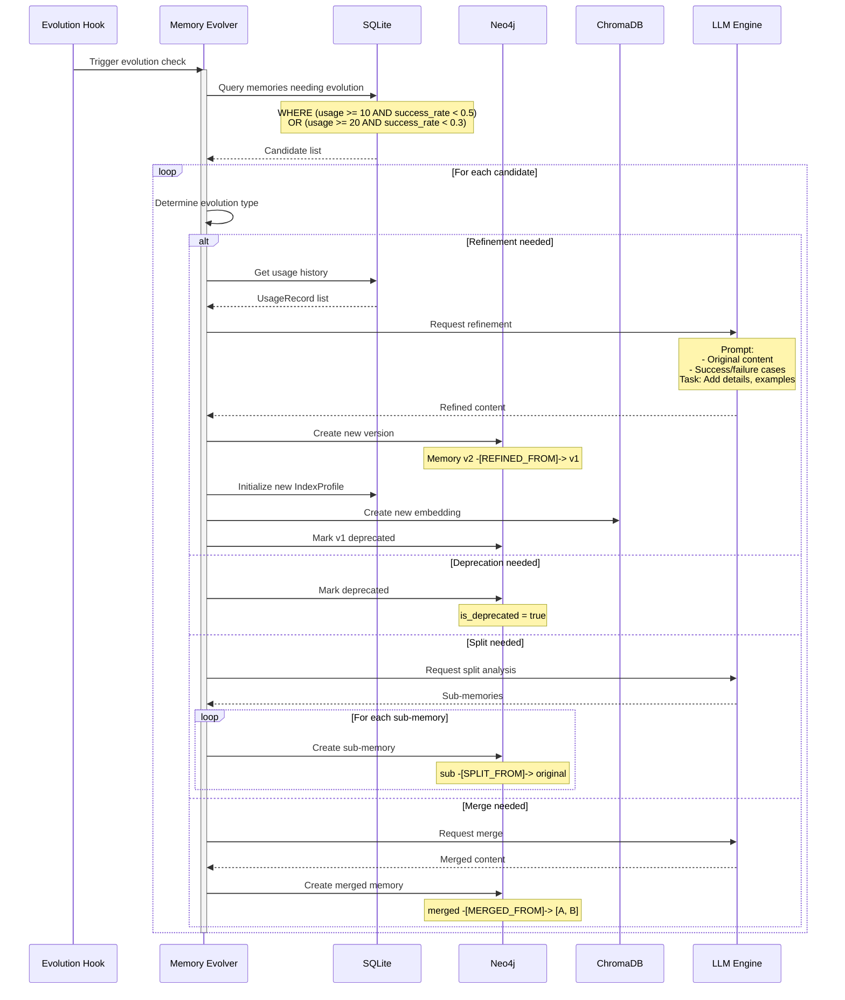
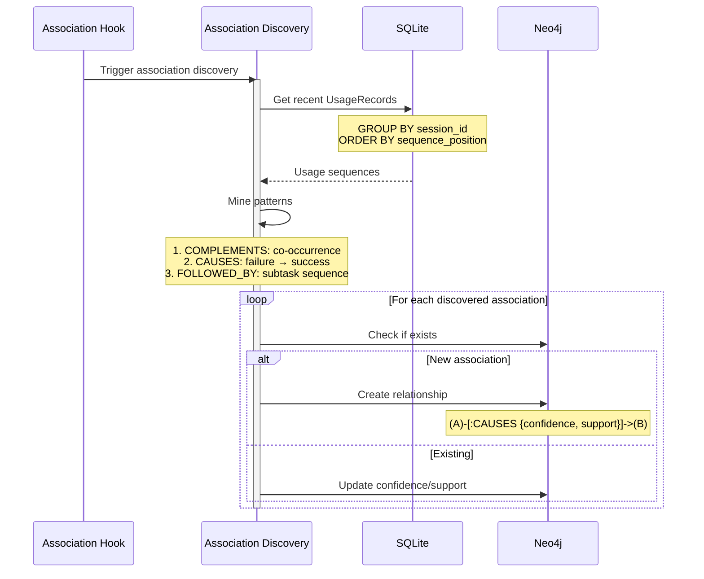

# **Core Workflows**

## **Workflow 1: Hot Path - Retrieval with Exploration (The Retrieval Loop)**

*Scenario: Agent is generating a response. Supports progressive result return.*

**Key Features:** Hybrid ranking + Adaptive exploration + Usage recording

**Two-Phase Design:**
- **Phase 1 (Sync fast retrieval):** Query memory cache + Bloom Filter, P95 < 50ms
- **Phase 2 (Async deep retrieval):** Vector similarity + Graph queries, P95 < 500ms



### **Hybrid Ranking Formula**

The ranking combines multiple signals:

| Signal | Weight | Description |
|--------|--------|-------------|
| **Similarity** | 0.4 | Vector similarity score |
| **Recency** | 0.15 | Time decay factor |
| **Importance** | 0.15 | Base importance weight |
| **Quality** | 0.2 | success_rate × confidence from IndexProfile |
| **Exploration** | 0.1 | Bonus for low-usage memories |

### **Adaptive Exploration Rate**

The exploration rate decays as the knowledge base matures:
- **Early stage (small KB):** ~20% exploration
- **Mature stage (large KB):** ~5% exploration
- **Decay formula:** `rate = initial_rate / (1 + total_usage / 1000)`

---

## **Workflow 2: Cold Path - Consolidation & Index Update (The Consolidation Loop)**

*Scenario: After conversation ends or during system idle. Async execution.*

**Key Features:** Feedback collection from XML tags + Index update + Evolution trigger check



### **Feedback Signal Format**

Agent marks memory usage outcomes in conversation using XML tags:
```
<skill id="xxx" outcome="success">skill content</skill>
<principle id="yyy" outcome="failure">principle content</principle>
```

The Feedback Collector parses these tags to extract:
- `memory_id`: The used memory's identifier
- `outcome`: success / failure
- `source_type`: skill / principle / memory

### **Weight Calculation**

Weight is derived from IndexProfile statistics:
- **Base weight:** 1.0
- **Quality factor:** success_rate × confidence
- **Weight range:** [0.1, 10.0]
- **Formula:** `weight = base + quality_factor × 9.0`

---

## **Workflow 3: Evolution Path - Induction & Philosophy Extraction (The Induction Loop)**

*Scenario: Periodically (e.g., weekly) or after N task accumulations.*



---

## **Workflow 4: Memory Evolution (Refinement, Split, Merge, Deprecate)**

*Scenario: When evolution triggers are met. Async execution.*

### **Evolution Types**

| Type | Description | Trigger Condition | Result |
|------|-------------|-------------------|--------|
| **Refinement** | Add details, examples, constraints | `usage >= 10 AND success_rate < 0.5` | v1 → v2 |
| **Split** | Break coarse memory into finer pieces | `usage >= 10 AND high variance` | v1 → [v1a, v1b] |
| **Merge** | Combine frequently co-occurring memories | `cooccurrence_rate > 0.8` | [A, B] → C |
| **Deprecate** | Mark as obsolete | `usage >= 20 AND success_rate < 0.3` | deprecated = true |



### **Version Evolution Relationships (Neo4j)**

| Relationship | Meaning | Example |
|--------------|---------|---------|
| `REFINED_FROM` | Improved version | v2 → v1 |
| `SPLIT_FROM` | Split from coarse | [v1a, v1b] → v1 |
| `MERGED_FROM` | Combined from multiple | v3 → [v1, v2] |

---

## **Workflow 5: Association Discovery**

*Scenario: Periodically (e.g., every 50 remembers or weekly).*

### **Association Types**

| Type | Meaning | Detection Method | Neo4j Representation |
|------|---------|------------------|---------------------|
| **CAUSES** | A failed → B succeeded | Sequential failure-success pattern | `(A)-[:CAUSES]->(B)` |
| **COMPLEMENTS** | A and B used together successfully | Co-occurrence in same subtask | `(A)-[:COMPLEMENTS]-(B)` |
| **FOLLOWED_BY** | A then B (subtask order) | Sequential pattern across subtasks | `(A)-[:FOLLOWED_BY]->(B)` |



### **Association-Aware Retrieval Enhancement**

When retrieving memories, the system can leverage discovered associations:
1. For top results, find complementary memories
2. Apply slight score penalty (e.g., ×0.8) to complementary results
3. Return enhanced result set

---

## **Memory Lifecycle State Diagram**


---

## **Storage Responsibilities Summary**

### **SQLite - High-frequency structured data**
- IndexProfile: Memory usage statistics
- UsageRecord: Individual usage records with sequence information
- Association metadata (confidence, support counts)

### **Neo4j - Graph relationships**
- Memory nodes with content and version info
- Version evolution relationships (REFINED_FROM, SPLIT_FROM, MERGED_FROM)
- Association relationships (CAUSES, COMPLEMENTS, FOLLOWED_BY)
- Semantic triples (subject-predicate-object)

### **ChromaDB - Vector retrieval**
- Memory embeddings for similarity search
- Metadata filtering support

---

## **Index Refresh Timing Summary**

| Timing | Operation | Frequency | Storage |
|--------|-----------|-----------|---------|
| **Immediate (recall)** | Create UsageRecord | Each recall | SQLite |
| **Immediate (remember)** | Extract feedback from XML | Each remember | - |
| **Short-term (post-remember)** | Update IndexProfile | Each consolidation | SQLite |
| **Medium-term (batch)** | Evolution check & execution | Every N remembers | All |
| **Medium-term (batch)** | Association discovery | Every N remembers | Neo4j |
| **Long-term (periodic)** | Cleanup low-quality memories | Weekly | All |

---

**Related Documents:**
- [System Design Philosophy](design.md) - Design philosophy and core concepts
- [System Architecture](architecture.md) - Overall architecture and technical choices
- [Component Details](components.md) - Component responsibilities and implementations
- [Key Interface Definitions](interfaces.md) - Data models and API interfaces
- [Memory Provenance](provenance.md) - Memory provenance and hierarchical semantic graph
