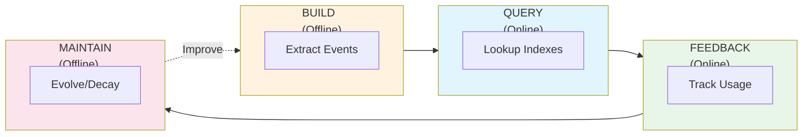
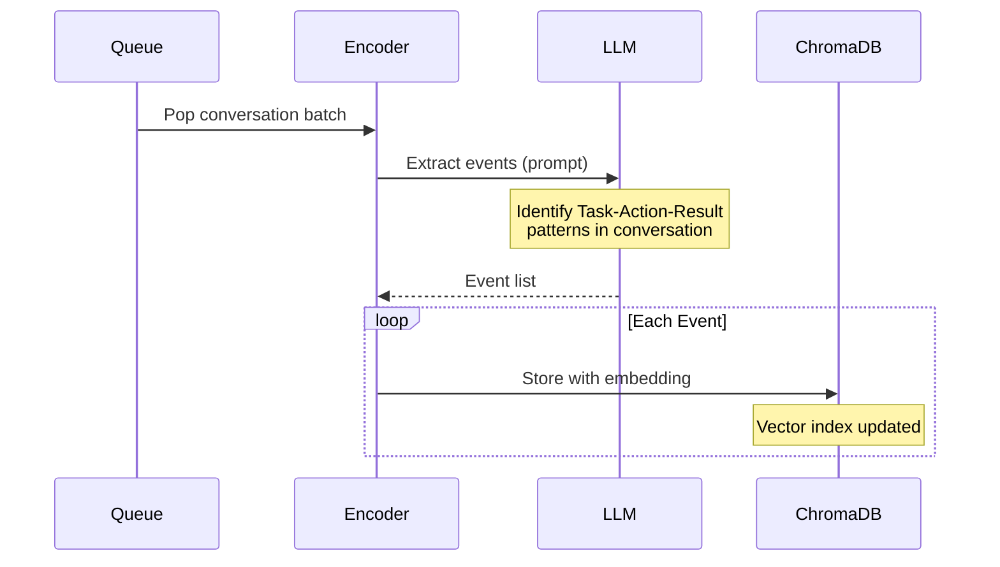
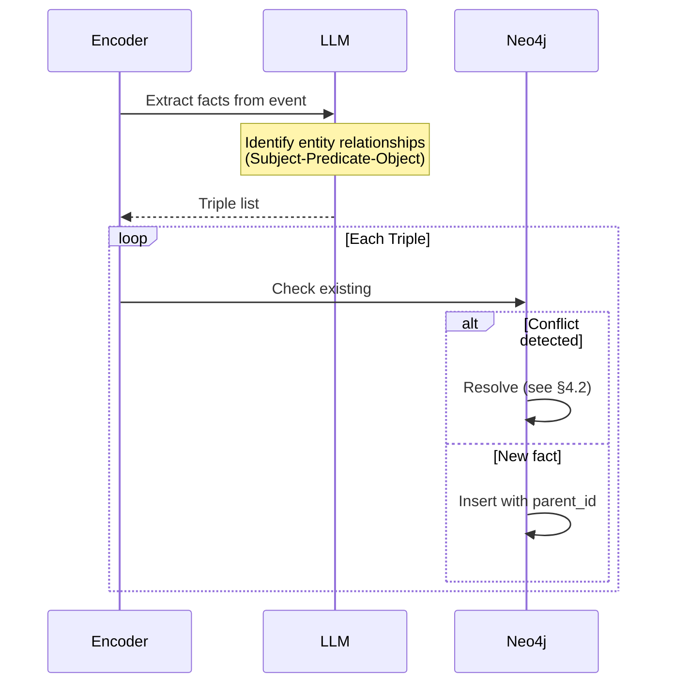
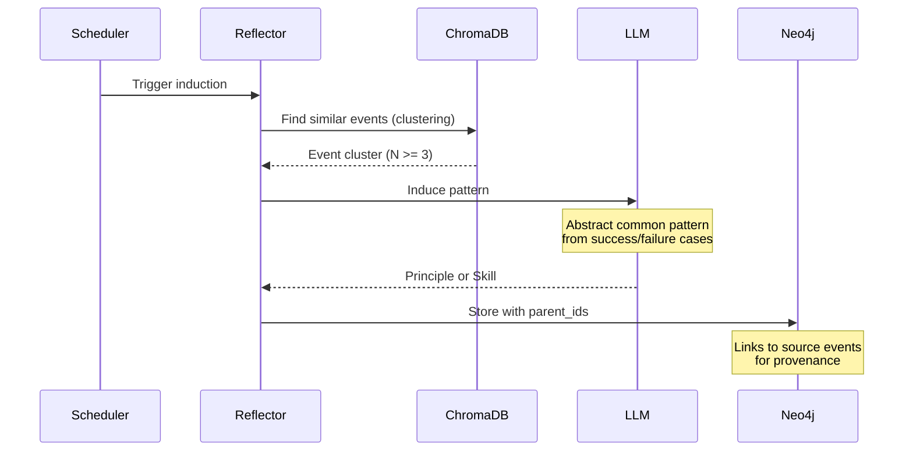
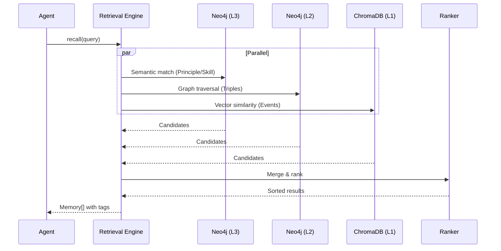
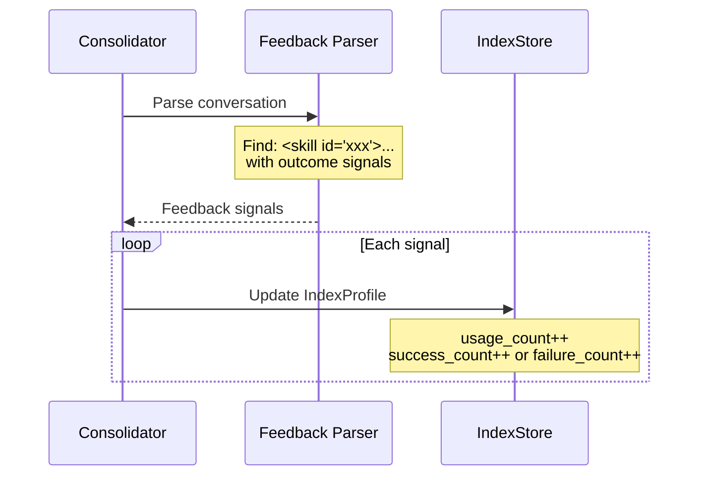
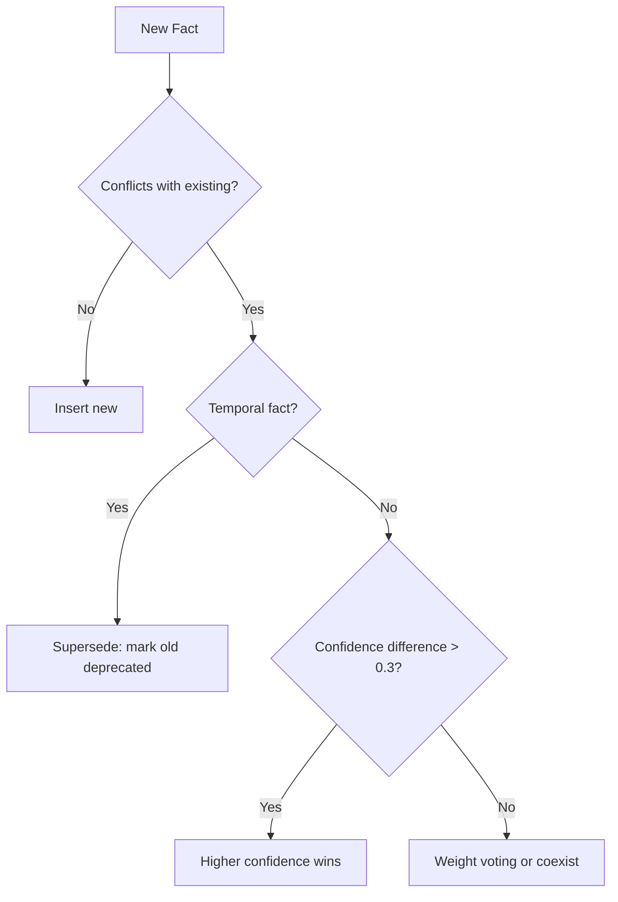
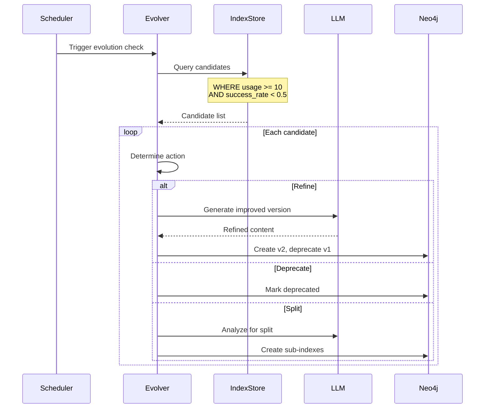
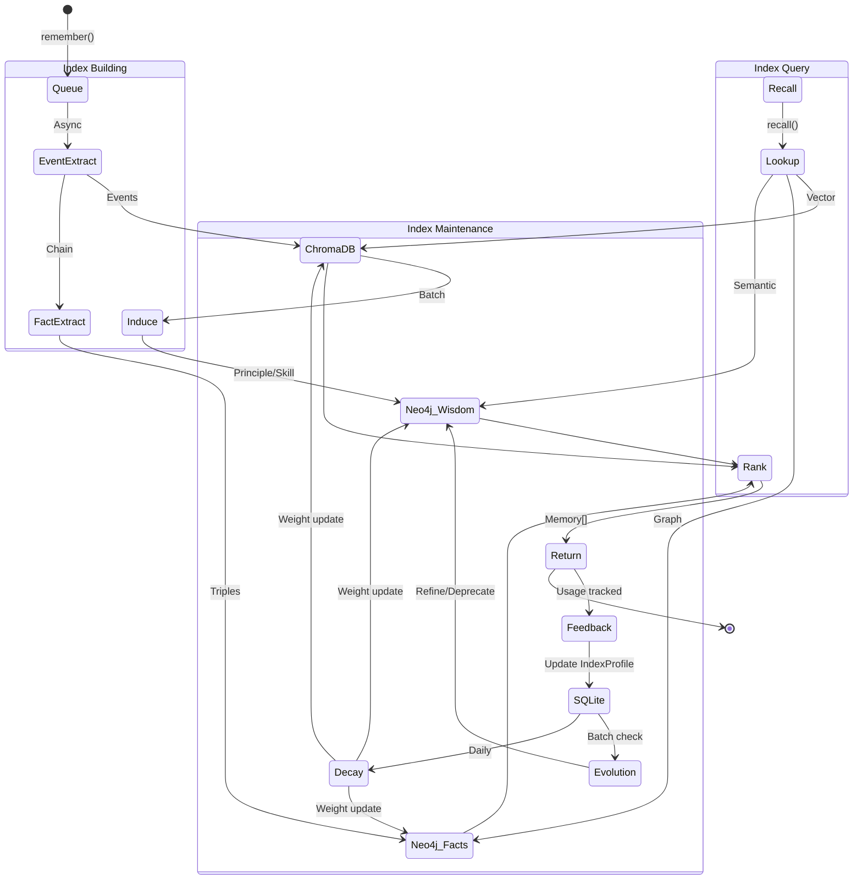

# **Core Workflows**

This document describes how indexes are built and maintained. For API contracts and data flow overview, see [architecture.md](architecture.md).

---

## **1. Overview: Index Lifecycle**



| Phase | Trigger | Latency | Purpose |
|-------|---------|---------|---------|
| **Build** | `remember()` | Async | Create L1/L2/L3 indexes |
| **Query** | `recall()` | < 200ms | Lookup and rank |
| **Feedback** | Usage in conversation | Immediate | Track success/failure |
| **Maintain** | Batch schedule | Async | Evolve, decay, cleanup |

---

## **2. Index Building**

### **2.1 L1: Event Extraction**

**Trigger:** New conversation in queue

**Input:** Raw conversation messages

**Output:** Structured Event records in ChromaDB



**Extraction Rules:**
| Pattern | Event Type | Example |
|---------|------------|---------|
| Task + Action + Success | Positive experience | "Used selenium, worked" |
| Task + Action + Failure | Negative experience | "requests.get failed on JS site" |
| User preference stated | Preference | "I prefer dark mode" |
| Correction/update | Knowledge update | "Actually, use v2 API now" |

### **2.2 L2: Fact Extraction**

**Trigger:** Event extracted (chained from L1)

**Input:** L1 Events

**Output:** SemanticTriple in Neo4j



**Fact Types:**
| Category | Predicate Examples | Storage |
|----------|-------------------|---------|
| Tool-Domain | GOOD_FOR, REQUIRES, REPLACES | Graph edge |
| User-Preference | LIKES, PREFERS, AVOIDS | Graph edge |
| Entity-Attribute | HAS_VERSION, LOCATED_AT | Graph edge |

### **2.3 L3: Wisdom Induction**

**Trigger:** Batch schedule OR pattern detected

**Input:** Cluster of similar L1 events

**Output:** Principle or Skill in Neo4j



**Induction Triggers:**
| Condition | Action | Rationale |
|-----------|--------|-----------|
| 3+ similar events | Induce Principle | Enough evidence |
| 5+ similar successes | Induce Skill template | Repeatable pattern |
| 3+ similar failures | Induce anti-pattern | Learn from mistakes |

---

## **3. Index Query (Retrieval)**

### **3.1 Parallel Lookup**



### **3.2 Ranking Formula**

```
final_score = w1×similarity + w2×recency + w3×quality + w4×exploration
```

| Factor | Weight | Source | Description |
|--------|--------|--------|-------------|
| **Similarity** | 0.4 | Vector/semantic match | How relevant to query |
| **Recency** | 0.2 | `last_used_at` | Prefer recent knowledge |
| **Quality** | 0.3 | `success_rate × confidence` | Prefer proven knowledge |
| **Exploration** | 0.1 | `1/log(usage_count)` | Try under-used knowledge |

### **3.3 Result Tagging**

Results are tagged for feedback tracking:
```xml
<principle id="p_001">Dynamic sites need browser automation</principle>
<skill id="s_001">Use selenium with explicit waits</skill>
<memory id="e_001">Last time selenium worked for JS site</memory>
```

---

## **4. Index Maintenance**

### **4.1 Feedback Collection**

**Trigger:** `remember()` with conversation containing used memories

**Mechanism:** Parse XML tags to extract usage outcomes



**Feedback Signals:**
| Signal | Detection | IndexProfile Update |
|--------|-----------|---------------------|
| Memory used, task succeeded | Positive context after tag | `success_count++` |
| Memory used, task failed | Negative context after tag | `failure_count++` |
| Memory recalled but not used | No follow-up action | `usage_count++` only |

### **4.2 Conflict Resolution**

When new facts conflict with existing ones:



| Strategy | When | Example |
|----------|------|---------|
| **Supersede** | Preferences, status | "I now prefer tea" replaces "I like coffee" |
| **Higher wins** | Different confidence | Expert opinion vs casual mention |
| **Coexist** | Context-dependent | "Tool A for X, Tool B for Y" |

### **4.3 Index Evolution**

**Trigger:** Batch schedule (e.g., every 50 `remember()` calls)



**Evolution Types:**
| Type | Trigger | Action | Result |
|------|---------|--------|--------|
| **Refine** | `usage >= 10 AND success_rate < 0.5` | Add details/constraints | v1 → v2 |
| **Deprecate** | `usage >= 20 AND success_rate < 0.3` | Mark unusable | `is_deprecated = true` |
| **Split** | High variance in contexts | Break into specific cases | v1 → [v1a, v1b] |
| **Merge** | `cooccurrence > 0.8` | Combine related | [A, B] → C |

### **4.4 Index Decay (Forgetting)**

**Trigger:** Daily batch job

**Purpose:** Reduce noise from outdated knowledge

```
weight(t) = weight_0 × exp(-λ × days_since_last_use)

Where λ varies by index type:
- Principle: 0.01 (slow decay, wisdom is stable)
- Skill: 0.03 (medium decay)
- Event: 0.05 (fast decay, details fade)
```

**Protection Shields:**
| Shield | Condition | Effect |
|--------|-----------|--------|
| High weight | `weight > 5.0` | Skip decay |
| Recent use | `last_used_at < 7 days` | Skip decay |
| High confidence | `confidence > 0.9` | Half decay rate |
| Has descendants | Active indexes derived from it | Cannot delete |

---

## **5. Complete Data Flow**



---

## **6. Timing Summary**

| Operation | Frequency | Trigger | Storage Affected |
|-----------|-----------|---------|------------------|
| Event extraction | Per `remember()` | Queue consumer | ChromaDB |
| Fact extraction | Per event | Chained | Neo4j |
| Wisdom induction | Every N events | Batch/pattern | Neo4j |
| Feedback update | Per `remember()` | XML parsing | SQLite |
| Evolution check | Every 50 remembers | Batch | All |
| Decay job | Daily | Scheduler | All |
| Cleanup | Weekly | Scheduler | All |

---

**Related Documents:**
- [System Architecture](architecture.md) - API contracts and data flow overview
- [Interface Definitions](interfaces.md) - Data model specifications
- [Acceptance Testing](acceptance-testing.md) - Verification test cases
