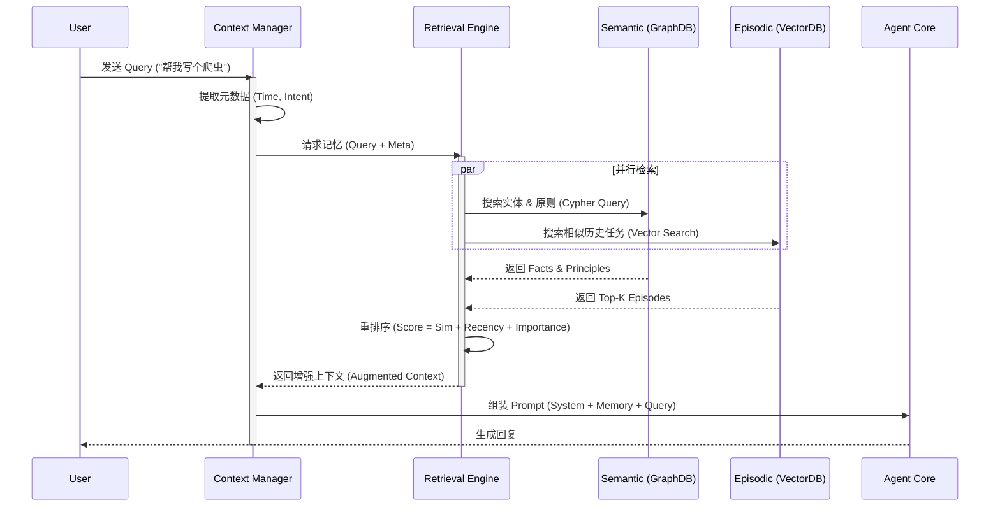
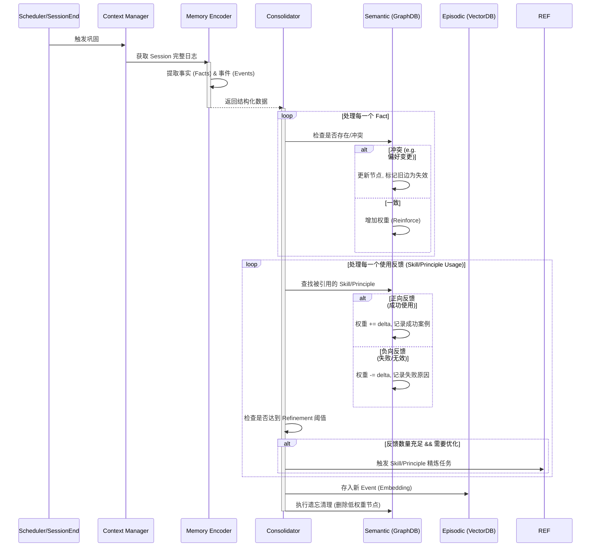
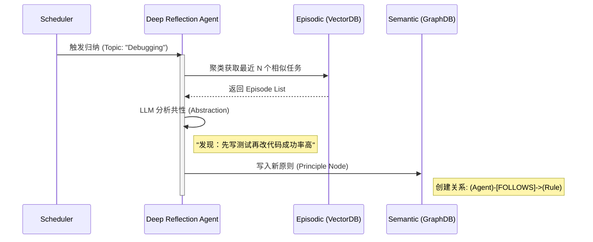
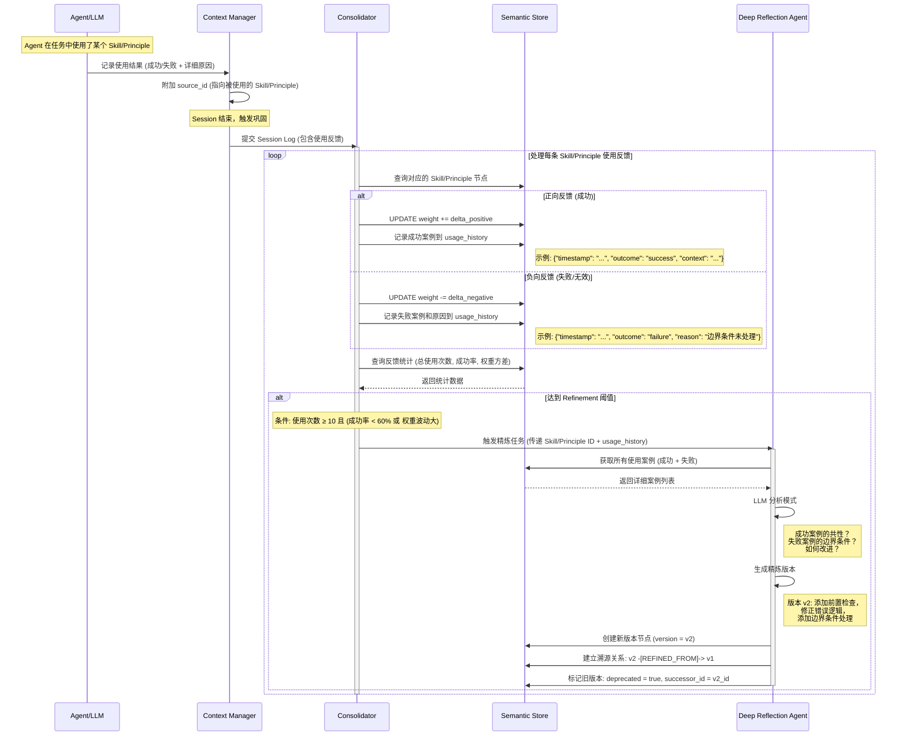
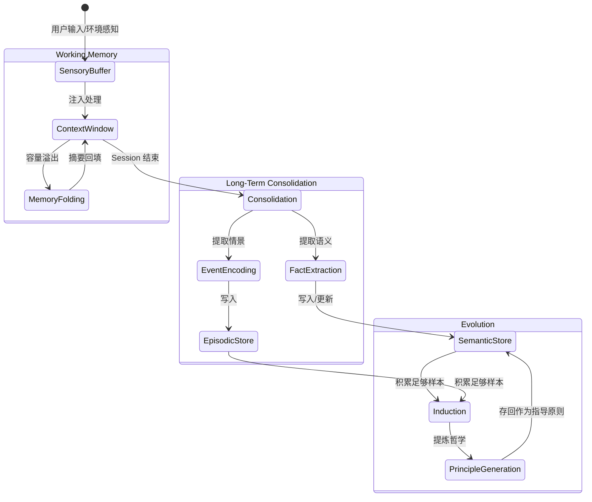

# **核心交互流程 (Core Workflows)**

## **流程 1：热路径 - 两阶段检索 (The Retrieval Loop)**

*场景：Agent 正在生成回复时。支持渐进式返回结果。*

**两阶段设计：**
- **Phase 1 (同步快速检索):** 查询内存缓存 + Bloom Filter，P95 < 50ms
- **Phase 2 (异步深度检索):** 向量相似度 + 图关系查询，P95 < 500ms

用户通过迭代器可选择：
1. 早期中断 - 只使用首批缓存结果（低延迟场景）
2. 完整等待 - 获取所有深度检索结果（高准确率场景）



---

## **流程 2：冷路径 - 巩固与刷新 (The Consolidation Loop)**

*场景：对话结束或系统空闲时。异步执行。*



---

## **流程 3：进化路径 - 归纳与哲学提取 (The Induction Loop)**

*场景：定期（如每周）或任务累计 N 次后。*



---

## **流程 4：反馈驱动的权重更新与精炼 (Feedback-Driven Weight Update & Refinement)**

*场景：当 Skill 或 Principle 被使用后，根据使用效果更新权重，并在积累足够反馈后触发精炼。*



**权重更新策略:**

```python
class WeightUpdateStrategy:
    """权重更新策略配置"""
    
    # 权重变化量 (可基于置信度动态调整)
    delta_positive: float = 0.1      # 成功时增加
    delta_negative: float = 0.15     # 失败时减少 (惩罚略大于奖励)
    
    # 权重边界
    weight_min: float = 0.0
    weight_max: float = 10.0
    
    # 自适应调整 (可选)
    adaptive: bool = True
    confidence_multiplier: float = 2.0  # 高置信度时放大变化量
    
    def calculate_delta(self, outcome: str, confidence: float) -> float:
        """计算权重变化量
        
        Args:
            outcome: 'success' or 'failure'
            confidence: 0.0-1.0, 表示使用结果的确定性
        
        Returns:
            权重变化值 (正数表示增加，负数表示减少)
        """
        base_delta = self.delta_positive if outcome == 'success' else -self.delta_negative
        
        if self.adaptive:
            # 高置信度的结果对权重影响更大
            return base_delta * (1 + confidence * self.confidence_multiplier)
        else:
            return base_delta

class RefinementTrigger:
    """Refinement 触发条件配置"""
    
    min_usage_count: int = 10           # 最小使用次数
    min_success_rate: float = 0.6       # 低于此成功率触发精炼
    max_weight_variance: float = 2.0    # 权重方差超过此值触发精炼
    time_window_days: int = 30          # 只考虑最近 N 天的反馈
    negative_feedback_ratio: float = 0.3  # 负反馈占比超过此值优先触发
    
    def should_refine(self, stats: dict) -> tuple[bool, str]:
        """判断是否应触发精炼"""
        if stats['usage_count'] < self.min_usage_count:
            return False, "insufficient_usage"
        
        if stats['negative_ratio'] >= self.negative_feedback_ratio:
            return True, f"high_failure_rate_{stats['negative_ratio']:.1%}"
        
        if stats['success_rate'] < self.min_success_rate:
            return True, f"low_success_rate_{stats['success_rate']:.1%}"
        
        if stats['weight_variance'] > self.max_weight_variance:
            return True, f"unstable_performance_var_{stats['weight_variance']:.2f}"
        
        return False, "stable"
```

---

## **记忆状态流转 (Memory Lifecycle)**

描述信息在系统中如何从瞬时感知转化为持久智慧。



---

**关联文档：**
- [系统设计理念](design.md) - 设计哲学和核心概念
- [系统架构](architecture.md) - 整体架构、约束和技术选型
- [组件详情](components.md) - 各个组件的职责和实现
- [记忆溯源](provenance.md) - 记忆溯源与层次语义图设计
